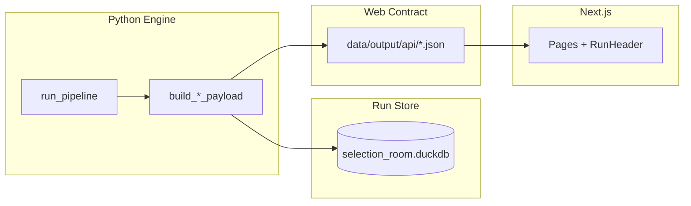

# Phase 2C: DuckDB Run Store (Approved)

## Verdict

**Approved** with guardrails below. This phase should be **boring**: a queryable local run store, not a backend rewrite.

**Key decision (locked):**
- DuckDB = local analytical run store
- JSON = stable web contract (source of truth for Next.js in this phase)
- Jobs = file-backed operational state (`data/output/jobs/*.json`)

## First milestone deliverables

1. DuckDB file with queryable run outputs
2. Dual-write during export
3. Rebuild from existing API JSON
4. CLI commands for local inspection
5. **No** web DB reads
6. **No** job table

## Stop conditions (do not over-build)

Ship when all of the following pass — then move to Scenario Lab:

- Sample run writes to DuckDB
- `sroom store runs` lists runs
- `sroom store query` prints readable output
- `rebuild --from-api` restores rankings / resumes / sensitivity
- Tests pass

**Do not** in this phase: over-optimize indexes, complex migrations, validation dashboard tables, web reads, Postgres, Scenario Lab.

## Implementation guardrails

1. **JSON exports remain the web source of truth** — Next.js does not read DuckDB.
2. **Job state stays file-backed** — no `run_jobs` table; Option A jobs unchanged.
3. **DuckDB stores stable pipeline outputs only** — not CFBD input cache parquet.
4. **Do not migrate** `data/cache/` into DuckDB.
5. **Table name `record_games`** (not `games`) — snapshot is from `record_games_df` (displayed-record universe), distinct from `ranking_games_df` / model inputs. Add `ranking_games` later only if needed.
6. **Rebuild from API** restores payload-derived tables; **skip `record_games` with a warning** unless a games snapshot exists in exports (it does not today — do not invent rows).
7. **Store failure policy** via env (see below).
8. **No Scenario Lab, web DB reads, Postgres, job DB migration, or validation dashboard** in this phase.

## Problem

Each full run touches ~14 JSON files plus CSV/HTML/manifests. Option B jobs infer success from [`runs.json`](data/output/api/runs.json) heuristics. Local debugging requires hunting `data/output/api/runs/{stem}/`. JSON was right early; it is now a mini-database with worse ergonomics.

**Prerequisites done:** Option B jobs, dynamic resume explanations, Run Header UX.

## Target architecture



Later (not now): `pipeline → store → API server → web`. Much later: Postgres for hosted multi-user.

## Database location and dependency

- Path: `data/output/selection_room.duckdb` (gitignored via `data/output/**/*`).
- Add **`duckdb>=1.0` to core dependencies** in [`pyproject.toml`](pyproject.toml) — run store is platform infrastructure, not an optional extra.
- New package: `src/store/`.

## Schema (v1)

### Column discipline

**Use typed columns** (queried constantly):

- `rank`, `team`, `seed`, `bid_type`, `in_field`
- score columns (`composite`, `resume`, `predictive`, `sor`, `sos`)
- `record` wins/losses
- `selection_frequency`, `stability_status`, `median_rank`, `primary_risk`
- schedule: `week`, `opponent`, `result`, `points_for`, `points_against`

**Use JSON columns** (nested / rarely filtered alone):

- `selection_case`, `why_in`, `concerns`
- bracket pod matchups (within `bracket_pods`)
- audit phase messages (within `audit_steps`)
- `record_meta`, `weights` on `runs`

### Tables

| Table | Primary key | Source |
|-------|-------------|--------|
| `runs` | `stem` | manifest + index metadata; `record_meta` JSON, `weights` JSON |
| `rankings` | `(run_stem, team)` | [`RankingsPayload.teams`](src/api_contracts/models.py) |
| `field_slots` | `(run_stem, seed)` | [`FieldPayload.field`](src/api_contracts/models.py) |
| `field_bubble` | `(run_stem, tier, rank)` | auto / at-large / first_four_out / next_four_out |
| `bracket_pods` | `(run_stem, pod_id)` | pod metadata + JSON matchups |
| `bracket_rounds` | `(run_stem, round, game_num)` | flattened rounds |
| `audit_steps` | `(run_stem, step_index)` | steps/phases; message blobs as JSON where needed |
| `team_resumes` | `(run_stem, team)` | resume fields as columns; `selection_case`, `why_in`, `concerns` as JSON |
| `team_schedule` | `(run_stem, team, week, opponent)` | [`ScheduleGame`](src/api_contracts/models.py) |
| `sensitivity_teams` | `(run_stem, team)` | [`SelectionStabilityTeam`](src/api_contracts/models.py) |
| `record_games` | `(run_stem, game_id)` | snapshot from **`record_games_df`** at export time only |

**Deferred:** `run_jobs`, `validation_results`, `ranking_games`.

**Schema versioning:** `store_meta` table (`schema_version`, `migrated_at`).

## Write path (dual-write)

Hook in [`export_run_api()`](src/api_contracts/export.py) after payloads are built, inside [`export_lock()`](src/pipeline/locks.py):

```python
write_run_to_store(
    config=config,
    paths=paths,
    result=result,
    payloads={...},
    record_games_df=record_games_df,
)
# Existing JSON writes unchanged
```

**Idempotency:** delete + bulk insert per `run_stem` (same overwrite semantics as JSON).

### Store failure policy

| `SELECTION_ROOM_STORE_REQUIRED` | Behavior |
|---------------------------------|----------|
| `1` (default) | Store write failure **fails export** — no silent JSON/DuckDB drift |
| `0` | Log warning, **continue JSON export** — emergency JSON-only escape hatch |

- Document in [`.env.example`](.env.example) and [`docs/development.md`](docs/development.md).
- **Tests use required mode** (`=1`).
- CI should use required mode.

Rationale: JSON is still the production web contract; early mapper bugs should not brick exports if you flip the override locally.

## Read path (dev tooling only)

```bash
sroom store status
sroom store runs
sroom store query "SELECT * FROM runs LIMIT 5" [--limit 100] [--format table|csv|json]
sroom store rebuild --from-api
```

**Query output:** readable table by default (pandas/tabulate-style). Options:
- `--limit` default 100 when not specified in SQL
- `--format table|csv|json`

**`rebuild --from-api`:**
- Scan [`data/output/runs/*_manifest.json`](src/pipeline/run.py) + [`data/output/api/runs/{stem}/`](src/api_contracts/export.py)
- Validate with existing Pydantic models; upsert payload-derived tables
- **`record_games`:** skip with warning — not present in API JSON today; never fabricate rows
- Log summary: tables restored, tables skipped

## Module layout

```
src/store/
  paths.py, schema.py, connection.py
  mappers.py      # Payload -> rows; column vs JSON discipline enforced here
  writer.py       # write_run_to_store + failure policy
  reader.py       # query + formatting
  rebuild.py      # rebuild_from_api
```

Mappers consume same objects as [`build.py`](src/api_contracts/build.py) — **no** ranking/selection logic duplication.

## Option B integration (optional, same PR)

- Python stdout: `SELECTION_ROOM_EXPORT stem=2025_week15` after successful export
- [`web/lib/runJob.ts`](web/lib/runJob.ts) parses before `runs.json` heuristics
- **No** DuckDB job writes

## Testing

- `tests/test_store_writer.py` — sample run, row counts, FK by `run_stem`
- `tests/test_store_rebuild.py` — export → wipe DB → rebuild → compare rankings/resumes/sensitivity; assert `record_games` skipped with warning
- `tests/test_store_failure_policy.py` — required vs optional env behavior
- Store tests run with `SELECTION_ROOM_STORE_REQUIRED=1`

## Documentation

- [`docs/development.md`](docs/development.md) — commands, example queries, env policy, rebuild limitations
- [`docs/project-structure.md`](docs/project-structure.md) — `selection_room.duckdb`, `src/store/`
- [`README.md`](README.md) — JSON for web, DuckDB for local analytics

## Roadmap (locked order)

1. Option B jobs stabilize ✓
2. Dynamic resume explanations ✓
3. **DuckDB run store** ← this phase
4. Scenario Lab MVP
5. Validation dashboard
6. Export/share

DuckDB before Scenario Lab: diff queries are where JSON hurts most.

## Non-goals (this phase)

- Postgres / Supabase / hosted DB
- Next.js reading DuckDB
- Removing JSON exports
- CFBD cache → DuckDB
- `run_jobs` / job DB migration
- Scenario Lab
- Validation dashboard / `validation_results` table
- Fancy indexes beyond `(run_stem, team)` basics

## Risk notes

| Risk | Mitigation |
|------|------------|
| JSON/DuckDB drift | Default fail-on-error; rebuild; env override |
| Early mapper bugs block exports | `SELECTION_ROOM_STORE_REQUIRED=0` escape hatch |
| Fake rebuild completeness | Skip `record_games`; warn loudly |
| `games` vs `record_games` confusion | Explicit table name + docs |
| Scope creep | Stop conditions above |
