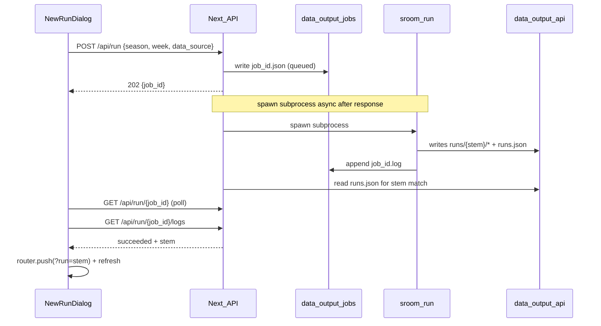

# Option B MVP: Server-Backed Run Generation

## Product truth

Option B means Selection Room is **no longer just a static frontend over JSON**. It becomes a **server application that runs jobs**. That is the right bridge between local dev terminal workflow and real web analyst workflow.

Keep this first version boring: one job, file-backed status, logs, capability probe, server CFBD key, `runs.json` refresh, no DB. Scenario Lab builds cleanly on top later.

---

## Implementation guardrails (read before coding)

1. **Persistent server required.** This MVP needs a persistent Node process with Python installed and writable storage. It is **not** intended for static export or purely serverless deployment (Vercel-style functions may not allow background work after response). Target: Railway, Render, Fly.io, DO App Platform, VPS, or containerized Node + Python. Document explicitly.

2. **Explicit env gate:** `SELECTION_ROOM_ENABLE_RUN_JOBS=1` must be set for run generation. `run_generation_enabled` requires:
   - env flag enabled
   - engine available
   - storage writable

3. **Stem resolution uses `runs.json`, not filename guesses.** After export, match:
   - `run_id === \`${season}_week${week}\``
   - `scenario_id === "base"`
   - `data_source === request.data_source`
   - `generated_at >= job.started_at`
   Then use that entry's `stem`. Fallback to latest only with a warning log if no match.

4. **Job metadata includes `pid` and `exit_code`** for stale active-job recovery and debugging.

5. **`queued` is not a real queue.** One active job only. `queued` = accepted, subprocess not yet spawned; `running` = subprocess started. No queue infrastructure.

6. **Live throttle:** `SELECTION_ROOM_LIVE_RUN_THROTTLE_MINUTES` (default 5). Allow `0` for local dev (no throttle). Sample runs exempt.

7. **Python export lock:** `fcntl.flock` on macOS/Linux with a simple lockfile fallback on unsupported platforms (or document non-Windows). Do not let this balloon.

8. **Out of scope:** Scenario Lab, custom weights, accounts, database, cancellation, run deletion.

---

## Current state (already shipped)

A **partial Layer 1** exists today:

- [`web/lib/runJob.ts`](web/lib/runJob.ts): spawns `python -m src.cli.main run --year … --week … [--sample]` via `spawn()` (arg array, no shell)
- [`web/app/api/run/route.ts`](web/app/api/run/route.ts): `POST` creates job, `GET` returns last in-memory job
- [`web/components/layout/NewRunDialog.tsx`](web/components/layout/NewRunDialog.tsx): season/week/source, polls `GET /api/run`, navigates to `?run=<stem>` on success
- One-at-a-time guard via in-memory `status === "running"` → 409
- Engine missing → 501

Product/Data Hardening (records, tiered resumes, run context bar) is **already implemented** and is orthogonal to this work.

---

## Target architecture



**Storage layout:**

```
data/output/
  jobs/
    active.json              # { job_id, pid } while running; removed on finish
    run_20260703_abc123.json # job metadata
    run_20260703_abc123.log  # append-only log (redacted)
    .live_throttle.json      # last live run timestamp
  api/
    runs.json                # source of truth for stem resolution
    runs/{stem}/...
```

Jobs are **not** served via `/api/data/`.

---

## Implementation plan

### 1. Shared path helpers (Node)

Add [`web/lib/paths.ts`](web/lib/paths.ts):

- `SELECTION_ROOM_REPO_DIR` → repo root
- `SELECTION_ROOM_DATA_DIR` → `data/output/api`
- `JOBS_DIR` → `repo/data/output/jobs`

Create directories on first write.

### 2. File-backed job registry

Replace in-memory store in [`web/lib/runJob.ts`](web/lib/runJob.ts):

```typescript
interface RunJobRecord {
  job_id: string;
  status: "queued" | "running" | "succeeded" | "failed" | "cancelled";
  created_at: string;
  started_at: string | null;
  finished_at: string | null;
  request: { season: number; week: number; data_source: "sample" | "cfbd" };
  stem: string | null;
  error: string | null;
  pid: number | null;
  exit_code: number | null;
}
```

**Lifecycle:**

- `createJob` → write JSON with `status: "queued"`
- Return 202 from POST immediately
- **Async:** `markRunning(job_id, pid)` → set `active.json`, `started_at`
- On child `close` → resolve stem, `finishJob`
- `queued` may exist only milliseconds; no real queue

**Concurrency / recovery:**

- Before spawn: if `active.json` exists, load job; if `status === "running"` and `pid` is alive (`process.kill(pid, 0)`), reject 409
- If PID dead or `finished_at` set → clear stale `active.json`, allow new job
- Cancellation out of scope; document stuck-job recovery in [`docs/development.md`](docs/development.md): delete `active.json` or manually mark job failed

**Stem resolution (future-safe for Scenario Lab):**

1. Prefer stem/manifest path printed by Python CLI stdout if we add a stable `--json-status` line later (optional stretch; not required for MVP if runs.json match works)
2. Else read `data/output/api/runs.json` after job exits successfully
3. Find newest run where:
   - `run_id === \`${season}_week${week}\``
   - `data_source` matches request
   - `scenario_id === "base"`
   - `generated_at >= job.started_at`
4. Use that `run.stem`
5. If no match, fall back to `runs.json.latest.stem` only with warning in job log

Do **not** rely on manifest filenames alone.

### 3. Capabilities endpoint

**Route file:** [`web/app/api/run/capabilities/route.ts`](web/app/api/run/capabilities/route.ts) — static segment **before** dynamic `[jobId]` so `capabilities` is never parsed as a job ID.

```json
{
  "run_generation_enabled": true,
  "engine_available": true,
  "storage_writable": true,
  "live_cfbd_enabled": false,
  "active_job_id": null,
  "runtime": "persistent_node",
  "supports_background_jobs": true
}
```

- `run_generation_enabled`: `SELECTION_ROOM_ENABLE_RUN_JOBS=1` AND engine AND storage
- `live_cfbd_enabled`: `Boolean(process.env.CFBD_API_KEY)` — never expose value
- `supports_background_jobs`: true when env gate enabled (honest default for persistent Node; document serverless limitation)
- `runtime`: `"persistent_node"` (informational)

### 4. API routes (App Router layout)

```
web/app/api/run/
  route.ts                    # POST create job; GET active job (legacy compat)
  capabilities/route.ts       # GET capabilities (static — must not collide with [jobId])
  [jobId]/route.ts            # GET job status
  [jobId]/logs/route.ts       # GET log tail
```

| Route | Behavior |
|-------|----------|
| `POST /api/run` | Validate season/week/data_source. Reject live if `!live_cfbd_enabled` → 400. Throttle live runs. 409 if active job. 501 if `!run_generation_enabled`. Create job, **spawn async**, return `{ job_id }` 202 immediately. |
| `GET /api/run/capabilities` | Deployment probe |
| `GET /api/run/[jobId]` | Full job record |
| `GET /api/run/[jobId]/logs` | `{ lines: string[] }` tail (~200 lines) |

**Request body:** `data_source: "sample" | "cfbd"`. Optionally accept legacy `{ sample: boolean }` mapped internally.

**POST must not block** on subprocess completion. Fire-and-forget spawn after writing job file; update status via child event handlers.

### 5. Security and guardrails

- **Subprocess:** arg-array spawn only; fixed CLI args
- **Never log child env**
- **Log redaction (simple):** before persisting, redact lines matching:
  - `CFBD_API_KEY=...`
  - `Authorization: Bearer ...`
  - `Bearer <token>`
  Do not over-engineer regexes that strip useful output.
- **Live throttle:** `SELECTION_ROOM_LIVE_RUN_THROTTLE_MINUTES` (default 5, `0` = disabled). Sample exempt.

### 6. Python export file lock

Add [`src/pipeline/locks.py`](src/pipeline/locks.py):

- Primary: `fcntl.flock` on `data/output/.export.lock` (macOS/Linux)
- Fallback: exclusive create of lockfile if `fcntl` unavailable

Wrap in [`src/api_contracts/export.py`](src/api_contracts/export.py): `regenerate_runs_index()` and `export_run_api()` flat writes.

### 7. NewRunDialog UX

[`web/components/layout/NewRunDialog.tsx`](web/components/layout/NewRunDialog.tsx):

1. On open → `GET /api/run/capabilities`
2. If `!run_generation_enabled` → disable "Run analysis" with clear deployment message
3. If `!live_cfbd_enabled` → disable Live CFBD toggle
4. Submit → POST → poll `/api/run/[jobId]` + logs every 2s
5. Status badges: Queued / Running / Succeeded / Failed
6. Success → `?run=<stem>` + refresh
7. Errors: 409, 501, 400 cfbd_unavailable, throttle, failed + log tail

### 8. Docs

**[`docs/web-app.md`](docs/web-app.md):**

- Job model, endpoints, capabilities
- Server-side CFBD only; no user API keys
- One job at a time
- **Deployment:** persistent Node + Python + writable `data/output/`; not for static/serverless-only hosting
- `SELECTION_ROOM_ENABLE_RUN_JOBS=1` to enable

**[`docs/development.md`](docs/development.md):**

- Env vars: `SELECTION_ROOM_REPO_DIR`, `SELECTION_ROOM_DATA_DIR`, `SELECTION_ROOM_ENABLE_RUN_JOBS`, `SELECTION_ROOM_LIVE_RUN_THROTTLE_MINUTES`
- Local dev: set `ENABLE_RUN_JOBS=1`, throttle `0`
- **Stuck job recovery:** delete `data/output/jobs/active.json` or edit job JSON to `failed`
- CI does not run web job generation

Add `data/output/jobs/` to `.gitignore`.

### 9. Verification

- Python unit test for export lock serialization
- Manual checklist:
  - Sample run → stem from `runs.json` match appears in switcher
  - Second POST while running → 409
  - Live without key → 400
  - Job files survive Next dev HMR restart
  - `SELECTION_ROOM_ENABLE_RUN_JOBS` unset → generation disabled in UI

---

## Explicitly out of scope

- Scenario Lab / custom weights in POST
- Accounts, Postgres, Redis, cloud workers, real job queue
- Cancellation, run deletion, scheduled refresh
- User-provided CFBD keys

---

## Layer 2 preview (do not build now)

`POST /api/run { season, week, data_source, weights }` → stem `2025_week15__<config_hash>` → diff UI vs base. Stem resolution will then match `scenario_id !== "base"` instead of `"base"`.
