# Selection Stability Chart (Phase 2A + 2B) — Revised

## Product decision (locked)

- **Name:** Selection Stability (not win probability / field probability)
- **Bubble Cut Line** ([`BubbleCutlineChart`](web/components/charts/BubbleCutlineChart.tsx)) = deterministic composite score gap
- **Selection Stability** = Monte Carlo uncertainty under weight perturbations
- **No interim proxy** — UI ships only when real `sensitivity.json` exists
- **Trust rule:** Document clearly that stability varies **model weights only**, not future game outcomes or conference championship changes

---

## Architecture

```mermaid
flowchart LR
  subgraph once [Once per run]
    Comp[resume predictive sor sos scores]
  end
  subgraph phase2a [Phase 2A Monte Carlo]
    Pert[uniform_relative ±10% perturb]
    Renorm[Renormalize weights to 1.0]
    Composite[Weighted composite only]
    Sel[select_playoff_field fixed champs]
    Agg[Aggregate selection_frequency]
  end
  subgraph contract [Contract]
    Sens[sensitivity.json]
  end
  subgraph phase2b [Phase 2B UI order]
    B1[2B-1 Bubble board]
    B2[2B-2 Drawer block]
    B3[2B-3 Scenario Lab diff]
  end
  Comp --> Pert --> Renorm --> Composite --> Sel --> Agg --> Sens
  Sens --> B1 --> B2 --> B3
```



**Boundary:** Python owns truth; Next.js owns presentation.

---

## Phase 2A — Data only (no UI)

> **Cursor instruction:** Implement Phase 2A only. Add real Selection Stability data generation. Do not build UI yet.

### Perturbation method (locked — explainable, not Dirichlet)

Use **uniform relative weight perturbation**, not Dirichlet (defer Dirichlet unless concentration parameter is documented).

For each scenario:

```python
base = {"resume": 0.50, "predictive": 0.30, "sor": 0.10, "sos": 0.10}

for each weight w:
    w_perturbed = w * random_uniform(1 - relative_range, 1 + relative_range)
    clamp at 0
renormalize all four to sum to 1.0
```

**Config (defaults):**

| Param | Default |
|-------|---------|
| `n_scenarios` | 1000 |
| `random_seed` | 42 |
| `relative_range` | 0.10 |

Export all three in `sensitivity.json` for reproducibility.

**`perturbation_spec` in JSON:**

```jsonc
{
  "method": "uniform_relative_weight_perturbation",
  "relative_range": 0.10,
  "base_weights": { "resume": 0.50, "predictive": 0.30, "sor": 0.10, "sos": 0.10 }
}
```

Document in [`docs/research/sensitivity-analysis.md`](docs/research/sensitivity-analysis.md).

### Performance: reuse precomputed component scores

**Do not** rerun Colley/Massey/Elo 1000 times.

1. **Once:** compute `resume_score`, `predictive_score`, `sor`, `sos` from existing rankings pipeline
2. **Per scenario:** recompute only:

```python
composite = (
    w_resume * resume_score
    + w_predictive * predictive_score
    + w_sor * sor
    + w_sos * sos
)
```

3. Sort by composite → run [`select_playoff_field`](src/selection/field.py)
4. Record in-field teams

Replace stub in [`src/validation/sensitivity.py`](src/validation/sensitivity.py). Wire from [`export.py`](src/api_contracts/export.py) after base run completes.

### Fixed assumptions (document in contract + tooltip)

- **Conference champion labels are fixed** for the run
- Selection Stability does **not** simulate alternate game outcomes or championship changes
- Tooltip copy (Phase 2B): *"Selection Stability changes model weights around the current run. It does not simulate future game outcomes."*

### Status bands (non-overlapping — locked)

Store `selection_frequency` as **0–1** in JSON; display **0–100%** in UI.

| Status | Range | UI label |
|--------|-------|----------|
| `lock` | ≥ 0.99 | Lock (99–100%) |
| `likely_in` | ≥ 0.75 and < 0.99 | Likely In (75–98%) |
| `bubble` | ≥ 0.25 and < 0.75 | Bubble (25–74%) |
| `likely_out` | > 0.01 and < 0.25 | Likely Out (2–24%) |
| `out` | ≤ 0.01 | Out (0–1%) |

### Team universe

Export bubble-scope teams: last four in + first four out + next four out + displaced (+ locks if useful for context). Target ~12–20 teams max.

### Per-team record (locked shape)

```jsonc
{
  "team": "Oklahoma",
  "abbreviation": "OU",
  "logo_url": "https://...",
  "primary_color": "#...",
  "selection_frequency": 0.42,
  "in_field_count": 420,
  "n_scenarios": 1000,
  "base_rank": 12,
  "base_seed": null,
  "base_selected": false,
  "base_status": "first_out",
  "status": "bubble",
  "median_rank": 12,
  "most_common_outcome": "first_out",
  "primary_risk": "auto_bid_displacement"
}
```

`n_scenarios` per team is optional redundancy — OK for hover if payload splits later.

### Full `sensitivity.json` contract

Add to [`src/api_contracts/models.py`](src/api_contracts/models.py), builder in [`build.py`](src/api_contracts/build.py), export in [`export.py`](src/api_contracts/export.py).

```jsonc
{
  "schema_version": 1,
  "season": 2025,
  "week": 15,
  "ruleset": "2025_plus",
  "generated_at": "...",
  "n_scenarios": 1000,
  "random_seed": 42,
  "perturbation_spec": {
    "method": "uniform_relative_weight_perturbation",
    "relative_range": 0.10,
    "base_weights": { "resume": 0.50, "predictive": 0.30, "sor": 0.10, "sos": 0.10 }
  },
  "base_field_cutoff": {
    "final_at_large_team": "Oregon",
    "final_at_large_score": 0.477,
    "first_team_out": "Oklahoma",
    "first_team_out_score": 0.312
  },
  "teams": [ /* per-team records above */ ]
}
```

`base_field_cutoff` links Selection Stability to the deterministic Bubble Cut Line — UI can cross-reference without recomputing.

Document in [`docs/api-contracts.md`](docs/api-contracts.md). Optional: `has_sensitivity: boolean` on runs index entry.

### Phase 2A tests

- Fixed `random_seed=42`, small `n_scenarios` → deterministic frequencies (snapshot or range assert)
- Same seed reproduces identical `sensitivity.json`
- No placeholder 100%/0% stub values
- Performance: N=1000 on sample data target <30s export time
- Status assignment covers all bands with no gaps/overlaps

### Phase 2A exit criteria

- `sensitivity.json` exported for sample + live runs
- Stub removed; real Monte Carlo only
- Perturbation method, fixed-champion assumption, and status bands documented

---

## Phase 2B — UI (only after `sensitivity.json` exists)

> **Cursor instruction:** Implement Phase 2B only after sensitivity.json exists. Do not call it win probability.

**Ship order:**

1. **2B-1** Bubble page `SelectionStabilityBoard` + explain copy
2. **2B-2** Drawer stability block
3. **2B-3** Scenario Lab diff MVP (text rows first)

Do **not** lead with Scenario Lab for the first stability chart.

### Shared copy ([`web/lib/explain.ts`](web/lib/explain.ts))

```ts
selection_stability: {
  label: "Selection Stability",
  description:
    "The share of Monte Carlo weight scenarios where a team remains in the projected field. It varies model weights, not future game results.",
}
```

**Card subtitle:** *How often each bubble team makes the projected field when model weights are reasonably perturbed.*

**Status chips:** Lock · Likely In · Bubble · Likely Out · Out

### 2B-1 — Bubble page (primary surface)

Component: [`web/components/bubble/SelectionStabilityBoard.tsx`](web/components/bubble/SelectionStabilityBoard.tsx) (or `web/components/charts/`).

**Placement:** [`web/app/bubble/page.tsx`](web/app/bubble/page.tsx) — below Cut Line chart, above three-column board.

**Visual: horizontal probability board (NOT time-series)**

```
Selection Stability
Out    Likely Out    Bubble    Likely In    Lock
0% ───── 25% ───── 50% ───── 75% ───── 100%
              [OU]        [Bama]    [Oregon]  [Michigan]
```

- **X-axis = `selection_frequency * 100`** (percentage axis — intuitive)
- **Y = rank row or jitter** (one row of logo dots, or stacked by rank order)
- Zone backgrounds via `ReferenceArea`: 0–1%, 2–24%, 25–74%, 75–98%, 99–100%
- Dotted grid, monochrome (`--border`) — ESPN-inspired but **no win-probability time curve**
- Logos via [`ChartLogoDot`](web/components/charts/ChartLogoDot.tsx) on [`logoSurfaceFrameClass`](web/lib/logoSurface.ts)

**Hover card (`SelectionStabilityHoverCard`):**

```
Oklahoma
Selection Stability: 42%
Made field in 420 of 1,000 scenarios
Base result: First Four Out
Median rank: #12
Primary risk: Auto-bid displacement
```

Click → team drawer.

**Missing file:** omit card entirely — no placeholder, no errors.

Load: `loadSensitivity(stem)` parallel to field/audit.

### 2B-2 — Team drawer

Add to [`ResumeContent.tsx`](web/components/team/ResumeContent.tsx) when team in `sensitivity.json`:

```
Selection Stability
████████████░░ 82%
Status: Likely In
Primary risk: Auto-bid displacement
```

Preload via `useSensitivity.ts` (same pattern as [`useTeamResumes.ts`](web/components/team/useTeamResumes.ts)) — no per-hover fetch.

### 2B-3 — Scenario Lab (later)

When Scenario Lab ships: weight slider changes show **OUT → IN / IN → OUT / stable** text diff. Optional head-to-head strip for two selected bubble teams only. Custom SVG curve deferred.

### TypeScript mirror (2B prep)

- [`web/lib/types.ts`](web/lib/types.ts) — `SensitivityPayload`, `SelectionStabilityTeam`, `BaseFieldCutoff`
- [`web/lib/data.ts`](web/lib/data.ts) — `RunFileKind: "sensitivity"`
- Fixture in [`web/lib/fixtures/sensitivity.json`](web/lib/fixtures/)

Can land in 2A (for contract validation) or start of 2B.

---

## Recharts MVP spec (horizontal board)

- `ScatterChart`: **X = selection_frequency × 100**, Y = row index (hidden or minimal)
- `ReferenceArea` for status zones (subtle opacity)
- Optional `ReferenceLine` at 25%, 50%, 75% with zone labels
- **Not:** Y = frequency with X = index (that reads like a time chart)

---

## Files to touch

| Phase | Files |
|-------|-------|
| 2A | [`sensitivity.py`](src/validation/sensitivity.py), [`models.py`](src/api_contracts/models.py), [`build.py`](src/api_contracts/build.py), [`export.py`](src/api_contracts/export.py), [`docs/api-contracts.md`](docs/api-contracts.md), [`sensitivity-analysis.md`](docs/research/sensitivity-analysis.md), tests |
| 2B-1 | `SelectionStabilityBoard.tsx`, `SelectionStabilityHoverCard.tsx`, [`bubble/page.tsx`](web/app/bubble/page.tsx), [`explain.ts`](web/lib/explain.ts), types + data |
| 2B-2 | [`ResumeContent.tsx`](web/components/team/ResumeContent.tsx), `useSensitivity.ts` |
| 2B-3 | Scenario Lab page (when built) |

---

## Test plan

### Phase 2A
- `random_seed=42` → reproducible export
- Component scores computed once; profiling confirms no repeated Massey/Elo
- Status bands exhaustive, non-overlapping
- `base_field_cutoff` matches deterministic field from same run

### Phase 2B
- Bubble board: horizontal 0–100% axis; logos at correct positions
- Missing `sensitivity.json` → no card
- Hover + drawer copy matches spec; no "win probability" language
- Light/dark logo readability
- Scenario Lab diff (2B-3 only)

---

## Deferred (explicitly out of scope)

- Dirichlet perturbation (unless documented with concentration param)
- Composite-gap proxy chart in Phase 1
- Simulating game outcomes or conference championship flips
- Time-series win-probability-style curves without a time axis
