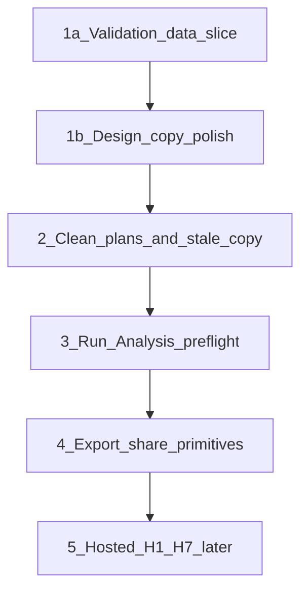

# Vision Status Cleanup — Living Handoff

> **SUPERSEDED (2026-07-03).** The "finish validation → export/share → local OSS
> feels complete" sequence this doc tracks is **done** — validation and
> export/share both shipped and Selection Room v1 is feature-complete. Archived
> for history. Current status lives in
> [`vision_progress_assessment_ca926609.plan.md`](vision_progress_assessment_ca926609.plan.md).

**Last updated:** 2026-07-03 (post validation/scenario design review)

**Product state in one sentence:** Selection Room is a local run-capable CFP selection analysis workspace with field/ranking/bracket/bubble explainability, browser-run generation, dynamic team cases, weight-based Scenario Lab, and a validation dashboard mostly implemented. The remaining gap is **not** Scenario Lab — it is **finish validation → export/share → local OSS feels complete**.

---

## North-star progress

| Step | Status |
|------|--------|
| 1. See the field | Done |
| 2. Understand the rule path | Done |
| 3. Inspect any team | Done |
| 4. Understand the bubble | Done |
| 5. Test what would change | **MVP shipped** (`d81e91a`) |
| 6. Validate (trust layer) | **Almost** — page + export WIP uncommitted |
| 7. Share / export | **Next** — not started |

---

## Layer scorecard

| Layer | Status |
|-------|--------|
| Layer 1 — Viewer | Done |
| Layer 2 — Platform (jobs, Run Analysis, DuckDB, dynamic resumes) | Done locally |
| Layer 2H — Hosted production | Designed only — [`docs/architecture/hosted-production.md`](../../docs/architecture/hosted-production.md) |
| Layer 3 — Scenario Lab | **Shipped** |
| Layer 4 — Institutional | Validation ~85% WIP; export/share not started |

**Do not start hosted adapters (H1–H7) yet.** Finish trust/share layer first.

---

## Scenario Lab — shipped; empty-state polish before "validation done"

**What works:**
- Dedicated nav, honest copy (not win probability)
- Weight sliders understandable; base-run fork concept clear
- Empty state explains what to do

**Design issue (final 15% — ship with validation polish pass):**

The right panel is a huge dead zone before a scenario runs. Fix with a **preview checklist** (no backend):

- Field changes
- Seed changes
- Bubble movement
- Bracket impact

**Copy fixes (same pass):**

| Current | Better |
|---------|--------|
| "Move a slider — these are the base weights, so there is nothing to compare yet." | "Adjust one or more weights to create a scenario. Base weights match the current run, so there is nothing to compare yet." |
| (generic disabled copy) | "This deployment can open existing scenarios, but cannot create new ones." |

**Also in polish queue (lower priority):**
- Human-readable base run label: `2025 Week 15 · Base` not `2025_week15`
- Catalog refresh after launch without full reload
- `?run=` deep-link on `/scenario-lab`

---

## Validation Dashboard — finish next

**Product read:** Structurally right — institutional page, not a dev report. The remaining issues are **final 15% trust-hierarchy polish**, not "this is bad." Ship after data/docs fixes **and** a design/copy pass so it does not feel like a scoreboard without enough explanation.

**What's working (keep):**
- Clear title + honest positioning
- Three trust dimensions (committee, field, predictive)
- Retrospective framing, season-level cards, disagreement examples

**Design/copy fixes (frontend only — no backend, no math):**

1. **Rename "Game Prediction" → "Predictive Signal"** — avoids future-forecast / win-probability connotation. Subtitle: *How the composite's game-level signal scored completed games; not a live forecast.*

2. **Headline cards need interpretation chips** — users may not know if 0.83 or 62% is good:
   - Committee Agreement · `0.83` · *Strong alignment with top-12 ordering*
   - Field Accuracy · scope label (see #3) · *Exact field size match*
   - Predictive Signal · `62%` · *Composite win-side accuracy on completed games*

3. **Scope "100% Field Accuracy"** — avoid marketing absolutism:
   - Label: `2024 Field Accuracy` or `Validated Seasons` with subtitle *For seasons included in the validation artifact*
   - If only 2024 is shown, make that unavoidable — not "all CFP history"

4. **Validation scope / caveat strip** (near top):
   > Retrospective · completed seasons only · era-correct rules · outlier seasons excluded/labeled where applicable

5. **Plain-English verdict per section** — one sentence under committee alignment, e.g.:
   > In 2024, the model matched 10 of the committee's top 12 teams and differed most around Alabama/Miami/Tennessee.

6. **Era-correct field selection — more prominent** — move key line near top:
   > Each season is judged against the playoff format that actually applied that year.

7. **Predictive bars — baseline decode help:**
   - Label: *Higher accuracy is better · lower Brier is better*
   - Optional per-year line: *Composite beats listed baselines in 2024.*

8. **Footer metadata row** (not buried tiny text):
   > Validation artifact · Generated Jul 3, 2026 · Target: all · Outlier seasons excluded: 2022

**Tone constraints:** Honest, non-official. No "official," no "committee got it wrong," no future win-probability language.

**Technical status (~85%, uncommitted WIP):**

| Piece | Status |
|-------|--------|
| VD-1 Python export (`build_validation_payload`, `export_validation_api`, CLI wire) | Done |
| VD-2 TS types + `getValidationData()` | Done; missing fixture |
| VD-3 `/validation` page + `ValidationDashboard` | Done |
| VD-4 Nav | Done; docs pending |

**Finish before export/share — one vertical slice:**

1. Review uncommitted validation WIP.
2. **Commit as one coherent validation PR/slice.**
3. Add [`web/lib/fixtures/validation.json`](../../web/lib/fixtures/validation.json) so `pnpm seed-fixtures` renders `/validation` offline.
4. Update docs:
   - [`docs/web-app.md`](../../docs/web-app.md)
   - [`docs/api-contracts.md`](../../docs/api-contracts.md)
   - [`docs/cli-reference.md`](../../docs/cli-reference.md)
   - [`docs/output-files.md`](../../docs/output-files.md)
5. Fix validation aggregation:
   - Headline predictive summary → **composite-only** rows (match CSV/markdown, not all models blended)
   - Outlier years → match CSV/markdown exclusion **or** clearly label headline stats as "all seasons"
6. Stop swallowing validation export errors in [`src/validation/reports.py`](../../src/validation/reports.py) — log failures.
7. Run `pytest tests/test_validation_contract.py`, `pnpm lint`, `tsc`, `pnpm build`.

**Acceptance:** Validation is "real" — seeded fixtures work, docs describe contract, aggregation honest, errors visible, **trust hierarchy polish applied**.

---

## Locked work order

1. **Validation data slice** — commit WIP, fixture, docs, aggregation, export logging
2. **Design/copy polish** — Validation trust hierarchy + Scenario Lab empty state (same PR or immediately after; **no backend/math**)
3. **Clean stale plan/docs state** (assessment refresh + archive + stale copy)
4. **Run Analysis preflight** (local UX only)
5. **Scenario Lab labels** — human-readable base run, catalog refresh (can slip here if needed)
6. **Export layer** — after validation fully ships
7. **Hosted H1–H7** — much later

---

## After validation ships — export/share (not more infra)

Start with **export primitives:**

- Bracket PNG / share card
- Rankings CSV download from web
- Team resume card export

Then later:

- Shareable scenario URLs
- Public hosted artifact storage

---

## Plan cleanup

**One living handoff doc:** [`vision_progress_assessment_ca926609.plan.md`](vision_progress_assessment_ca926609.plan.md) — refresh to reflect current state.

**Master vision (keep, update todos):** [`selection_room_vision_5f27cf0d.plan.md`](selection_room_vision_5f27cf0d.plan.md)

**Active sprint until validation ships:** [`validation_dashboard_mvp.plan.md`](validation_dashboard_mvp.plan.md)

**Archive to `.cursor/plans/archive/` — do NOT delete:**

| Plan | Reason |
|------|--------|
| `scenario_lab_mvp.plan.md` | Shipped `d81e91a` |
| `option_b_run_jobs_e25d06fb.plan.md` | Shipped in platform layer |
| `duckdb_run_store_39aea488.plan.md` | Shipped |
| `selection_stability_visual_6f4f62ca.plan.md` | 2A + bubble/drawer done; scenario diff superseded |

Useful implementation history; agents should not re-read these for current work.

**Stale copy to fix (same pass as validation):**

- [`docs/architecture/hosted-production.md`](../../docs/architecture/hosted-production.md) — migration table
- [`docs/configuration.md`](../../docs/configuration.md) — Scenario Lab CLI note
- [`web/components/layout/RunAnalysisDialog.tsx`](../../web/components/layout/RunAnalysisDialog.tsx) — Create tab ("Custom weights come later")

---

## Claude handoff (paste verbatim)

> Claude, do not start new product scope.
> First finish the Validation Dashboard vertical slice, then do the design/copy polish pass.
>
> ### Phase A — Data slice
> 1. Review current uncommitted validation WIP.
> 2. Commit as one coherent validation PR/slice (or data-only commit if splitting).
> 3. Add `web/lib/fixtures/validation.json` so `/validation` works with seeded fixtures.
> 4. Update docs: `docs/web-app.md`, `docs/api-contracts.md`, `docs/cli-reference.md`, `docs/output-files.md`
> 5. Fix validation aggregation: headline predictive summary = composite-only rows; outlier years match CSV/markdown or are clearly labeled.
> 6. Stop swallowing validation export errors; log failures.
>
> ### Phase B — Design/copy polish (no backend, no math, no scenario execution changes)
> **Validation Dashboard** ([`ValidationDashboard.tsx`](../../web/components/validation/ValidationDashboard.tsx), [`validationFormat.ts`](../../web/lib/validationFormat.ts)):
> - Rename "Game Prediction" → **"Predictive Signal"** + subtitle about completed games, not live forecast
> - Scope headline cards — especially Field Accuracy (2024 / included seasons, not all-history)
> - Add compact **Validation scope** strip near top
> - Add plain-English **verdict line** per section (committee, era-correct field, predictive)
> - Prominence for era-correct rules line near top
> - Predictive section: "Higher accuracy is better · lower Brier is better" + baseline comparison hint
> - Footer metadata row: generated_at, target, outlier seasons
> - Keep tone honest; no official / win-probability language
>
> **Scenario Lab** ([`ScenarioLabWorkspace.tsx`](../../web/components/scenario/ScenarioLabWorkspace.tsx)):
> - Empty right panel: preview checklist (field, seed, bubble, bracket changes)
> - Base-weight copy: "Adjust one or more weights to create a scenario..."
> - Disabled deployment copy: "This deployment can open existing scenarios, but cannot create new ones."
>
> Run `tsc` + `pnpm build` after. No new charts unless using existing validation payload.
>
> ### Phase C — Plan cleanup
> 7. Refresh `vision_progress_assessment_ca926609.plan.md`
> 8. Archive completed plans to `.cursor/plans/archive/` (archive, do not delete)
> 9. Fix stale copy: hosted-production table, configuration.md, RunAnalysisDialog Create tab
>
> **Do not:** hosted adapters, JSON→DB page reads, rebuild Scenario Lab, export/share until validation + polish done.
>
> **After validation ships:** export/share (bracket PNG, rankings CSV, resume card).

---

## Bottom line

Much closer than the pre-Scenario-Lab assessment suggested.

**Next honest milestone:** Finish Validation → Export/share → local OSS product feels complete.

**Doctrine (unchanged):** JSON under `data/output/api/` is the web contract. DuckDB is local analytics only. Scenario runs never own `latest.json`.
