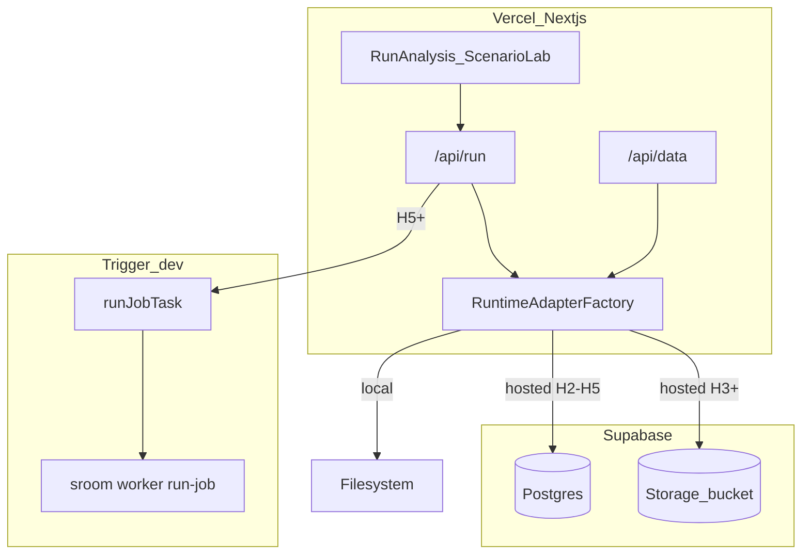

# Hosted Runs v1 Implementation Plan

**Status:** Approved. **H1 done. H2 done.** Next: H3 only.

## Goal

Ship real server-backed run generation on hosted infrastructure while **public demo stays read-only** and **local OSS keeps working**.

**Stack:** Vercel + Supabase Postgres + Supabase Storage + Trigger.dev worker.

**Access control (v1):** Beta access code + one active job globally + daily job cap. No accounts.

---

## Three runtime modes

| Mode | Env | Run generation | Artifacts |
|------|-----|----------------|-----------|
| **Public demo** | `NEXT_PUBLIC_SELECTION_ROOM_DEMO_MODE=1` | Disabled | Bundled `.demo-data` |
| **Local OSS** | `SELECTION_ROOM_RUNTIME=local` (default) | Subprocess Option B | `data/output/api/` |
| **Hosted live** | `SELECTION_ROOM_RUNTIME=hosted` | Postgres + Trigger worker | Supabase Storage |

---

## Architecture



**Constraint:** Vercel API routes never run long-running Python.

---

## Canonical product run URL

Completed runs open on the **dashboard**, not the landing page:

```
/dashboard?run=<stem>
```

Not `/?run=<stem>`. Apply in H6 UI and all hosted completion links.

---

## Environment variables

```bash
SELECTION_ROOM_RUNTIME=local|hosted          # default: local
SELECTION_ROOM_ARTIFACT_STORE=filesystem|supabase

# Supabase (server/worker only)
SELECTION_ROOM_DATABASE_URL=
SUPABASE_URL=
SUPABASE_SERVICE_ROLE_KEY=
SUPABASE_STORAGE_BUCKET=artifacts

# Worker / access (H4+)
TRIGGER_SECRET_KEY=
SELECTION_ROOM_BETA_ACCESS_CODE=
SELECTION_ROOM_HOSTED_DAILY_JOB_CAP=10
SELECTION_ROOM_HOSTED_MAX_CONCURRENT=1

CFBD_API_KEY=                                # worker/server only
```

---

## Guardrails

- Do not create abstractions unused by local mode or the upcoming Supabase/Trigger path.
- Every interface method must be exercised (runtime code or focused test).
- Do not implement H2–H7 until the prior phase is merged and verified.
- No accounts, billing, V2.5, model changes, or Python inside Vercel.

---

## Phase sequence

| Phase | Scope | Status |
|-------|-------|--------|
| **H1** | Adapter interfaces + local implementations + factory | **Done** |
| **H2** | Supabase migration + Postgres stores | **Done** |
| H3 | Supabase Storage artifact read path | Not started |
| H4 | Provider-aware job API, beta gate, rate limits | Not started |
| H5 | Worker CLI + Trigger.dev + artifact upload | Not started |
| H6 | Hosted UI (`/dashboard?run=`), beta code field | Not started |
| H7 | Docs and deploy runbook | Not started |

---

## H1 acceptance (current)

- Public demo still works
- Local `make web` still works
- Run Analysis still works locally
- No Supabase/Trigger/hosted env required
- No hosted behavior active yet
- Lint, typecheck, demo build pass
- Tests: add only if straightforward; otherwise lint/typecheck/build + focused pure-function tests

---

## Deployment model

Two Vercel projects on same repo:

1. `selection-room` — public demo (unchanged)
2. `selection-room-hosted` — hosted env (H7)

---

## Out of scope (v1)

Accounts, billing, workspaces, admin dashboards, V2.5, model changes.
