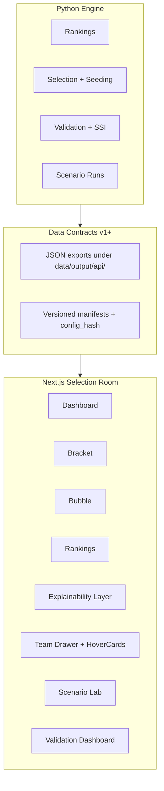

# Selection Room Vision and Roadmap (Locked)

## Product thesis (internal doctrine)

> **Selection Room is not a dashboard. It is a guided decision platform.**

That sentence stops random chart additions and keeps the product focused.

The user flow everything must support:

1. **See the field**
2. **Understand the rule path**
3. **Inspect any team**
4. **Understand the bubble**
5. **Test what would change**
6. **Share or export the result**

If a chart or page does not help one of those six steps, it waits.

**Benchmark for "best of best":** a user can understand a CFP field faster and more deeply here than anywhere else — not "has lots of charts."

**Buildout order (locked):**

Explain first → bracket flagship → signature visuals → scenarios/uncertainty → institutional/share layer

That requires all three lanes:

- **ESPN-style clarity** — clean hierarchy, logos, readable matchups, fast scan, strong bracket
- **FiveThirtyEight-style transparency** — methodology visible, uncertainty shown, assumptions adjustable, historical validation
- **Institutional credibility** — versioned data, audit logs, case studies, citations, no overclaiming

---

## Interaction hierarchy (formalized)

Prevents tooltip/hover/drawer chaos:

| Layer | Use for | Component |
|-------|---------|-----------|
| **Tooltip** | Short definitions | shadcn `Tooltip` — Resume, Predictive, SOR, SOS, Auto Bid, At-Large, Bye, Cut Line, Selection Stability |
| **HoverCard** | Rich entity preview | shadcn `HoverCard` — team, matchup, bubble decision, ruleset |
| **Drawer (Sheet)** | Deep inspection | shadcn `Sheet` — team resume, team comparison (future), scenario impact (future) |
| **Page** | Workflows | bracket, rankings, bubble, scenario lab, validation, methodology |

**Core rule:**

- **Desktop:** hover = quick context · click = deep inspection
- **Mobile/touch:** tap opens drawer (no hover dependency)

Design hover cards and drawers so **team comparison** (e.g. Oklahoma vs Georgia side-by-side) can be added later without rework.

---

## Cross-cutting standards (apply from Phase 1A onward)

### Copy and tone

- Use **"projected"** and **"simulated,"** not "official"
- Explain assumptions plainly
- Avoid "committee got it wrong" framing
- Prefer **"model differs from committee"** or **"under this ruleset"**
- Use **"Resume,"** not "Résumé"

### Design tokens

- Dark sports analytics base
- **Red** — sparingly for active state / emphasis
- **Gold** — reserved for byes, championship, high-value status
- **Blue/neutral** — at-large
- **Green** — selected / positive
- **Gray** — unselected
- Avoid betting-app neon and overanimation

(Lives in [`web/app/globals.css`](web/app/globals.css) today; extend consistently, do not reinvent per component.)

### Accessibility

- Tooltip/hover content must **not** be the only way to access critical information
- All team rows/cards must be **keyboard focusable**
- **Enter/Space** opens the team drawer
- Tooltip triggers must have **accessible labels** (`aria-label` or visible text association)
- **Color cannot be the only indicator** of bid status (use badge text + icon/shape)

### Performance guardrails

- Use optimized logo assets or constrained external images
- **Lazy-load** rich hover content where possible
- **Memoize** derived team lookup maps
- Keep chart point counts limited on dashboard; full charts live on dedicated pages
- **Do not fetch per hover** — preload `team-resumes.json` for the active run once, read from memory ([`useTeamResumes.ts`](web/components/team/useTeamResumes.ts) pattern, extended with run scoping)

### Visuals answer one question

Every chart must have a one-sentence question before it ships. No decoration charts.

---

## Visualization tool stack

| Surface | Tool | Why |
|---------|------|-----|
| Rankings table | TanStack Table + custom styling | sort, filter, sticky header, row click, badges, metric bars, tooltips |
| Standard charts | Recharts (already installed) | cutline chart, validation trends, small multiples |
| Logo scatter | Recharts `ScatterChart` + custom `TeamLogoPoint` shape in Phase 1C; visx/custom SVG only if interaction limits appear later | |
| Bracket | Custom React + CSS Grid + SVG connectors | layout component — not Recharts/D3/Plotly |
| Tooltips / hover / drawer | shadcn Tooltip, HoverCard, Sheet | clean interaction hierarchy |

**Deferred chart:** `MetricContributionBars` — scatter → cutline → contribution bars.

---

## Where you are today (post-`main` merge)

### Engine — largely trustworthy

- Era-aware rules, conference champions, tiebreakers, displacement
- Validation suite (committee, selection, predictive) — CSV only, no JSON API
- SSI stub only ([`src/validation/sensitivity.py`](src/validation/sensitivity.py))
- Run identity = `{year}_week{week}` — scenario variants collide

### Web — click path strong, explainability weak

- Global Team Resume drawer works on most surfaces
- Hover cards **only** on bracket `TeamSlot`
- No reusable tooltip system; badges use native `title`
- `MatchupCards` static; drawer may ignore `?run=`
- `recharts` installed, unused
- Bracket functional but not flagship-quality — **target: the most shareable page in the product**

---

## Revised phased roadmap

Each Phase 1 slice = **one PR**. No engine or contract changes in Phase 1.

### Phase 1A — Explainability primitives (PR 1) — **start here**

**Goal:** Make the product understandable everywhere before adding charts or bracket redesign.

**Build:**

- [`web/components/explain/InfoTooltip.tsx`](web/components/explain/InfoTooltip.tsx)
- `MetricTooltip`, `BadgeTooltip`
- Central metric and badge explanation copy (see copy standard)
- [`TeamHoverCard`](web/components/team/) extracted from bracket `TeamSlot`
- `MatchupHoverCard` (basic)
- Team drawer `?run=` scoping fix + single preload of `team-resumes.json` per active run

**Apply to:**

- Rankings column headers + metric labels
- Dashboard field rows, metric cards, matchup cards
- Bubble rows + labels
- Bracket team slots
- Methodology score components
- Badges: AUTO, AT-LARGE, BYE, FIRST OUT, OUT, SAMPLE DATA, BRACKET READY

**Exit criteria:**

- Every metric label has a tooltip
- Every badge has a tooltip
- Every team row/card supports **quick preview on hover where available** and **deep inspection on click/tap**
- Drawer respects active `?run=`
- No raw `title`-only tooltips except tiny fallbacks
- Accessibility and performance standards met (keyboard, labels, no per-hover fetch)

**Why first:** Tooltips are the core product promise ("every number explainable"). Once interaction is consistent, every existing page feels smarter without new complexity.

**Scope guard:** No bracket redesign, no charts, no Scenario Lab, no validation UI in this PR.

---

### Phase 1B — Bracket as the flagship (PR 2)

**Goal:** The **most shareable page** in the product — what people judge first.

**Scope guard:** Bracket only. No cutline charts, Scenario Lab, validation, or data model changes.

**Build:**

- Pod-first CFP-native layout (not a generic March Madness clone)
- Larger team slots: seed | logo | team | record | bid badge
- CFP round labels (Campus Sites, Bowl Sites, etc.)
- `MatchupHoverCard` (full comparison)
- Campus games summary + quarterfinal byes summary below bracket
- Better connector spacing; reduce horizontal dead space
- Share/export polish
- Keep Full Bracket, Pod/Round View, and Matchups modes

**Pod mental model:**

- Pod A: 8/9 winner plays 1
- Pod B: 5/12 winner plays 4
- Pod C: 6/11 winner plays 3
- Pod D: 7/10 winner plays 2

**Bracket must answer:**

- Who has a bye?
- Who hosts first-round games?
- Which pod feeds which semifinal?
- What does each matchup mean?

**Exit criteria:** Bracket instantly readable; CFP-specific; hover/tap + click on all real team slots and matchups; shareable.

---

### Phase 1C — Signature analytics visuals (PR 3)

**Goal:** Add only two product-defining charts. Each answers exactly one question.

| Chart | One-sentence question |
|-------|----------------------|
| `ResumePredictiveScatter` | Who has a strong resume versus a strong predictive profile? |
| `BubbleCutlineChart` | Who is closest to the selection cut line and why? |

**Build:**

1. `ResumePredictiveScatter` — logo points, quadrants, rich hover (Dashboard or Rankings)
2. `BubbleCutlineChart` — logo strip along composite axis, cut gap, displacement on hover (Bubble page)
3. Dashboard mini cutline snapshot
4. Collapsible audit on Bubble (`How this field was selected`)

**Defer:** `MetricContributionBars`

**Exit criteria:** Two question-driven visuals live; audit collapsible; performance guardrails on chart point counts; no simulator changes.

---

### Phase 2A — Scenario contracts

**Goal:** Multi-run identity and uncertainty data before Scenario Lab UI.

**Engine + contracts:**

- `scenario_id` (or scenario-aware stem) so weight variants do not collide
- `config_hash`, `weights`, optional `label` in [`runs.json`](docs/api-contracts.md)
- Real Monte Carlo in [`src/validation/sensitivity.py`](src/validation/sensitivity.py)
- New `sensitivity.json` — per-team `selection_frequency`, SSI label, perturbation spec

---

### Phase 2B — Scenario Lab

**Goal:** User flow step 5 — test what would change.

**Web:**

- Weight sliders, ruleset toggle (2024 vs 2025+)
- Field / bracket / bubble diff on adjust
- SSI badges on bubble rows and drawer
- Parameterized run launcher ([`web/app/api/run/route.ts`](web/app/api/run/route.ts))

**Exit criteria:** Scenarios reproducible, distinguishable in run switcher, uncertainty visible.

---

### Phase 3 — Institutional and share layer

**Priority order (locked):**

1. **Validation dashboard** — historical backtest, case studies, committee alignment
2. **Export tools** — bracket image, team resume card, bubble board
3. **Shareable scenario URLs**
4. **Optional** FastAPI scenario endpoint
5. **Optional** run store (DuckDB/Postgres) — last

Institutional credibility comes from validation, methodology, and audit — not from having a database.

No accounts required. Keep frictionless.

**Future (design for, do not build yet):** side-by-side bubble team comparison in drawer.

---

## Architecture (unchanged boundary)



**Python owns truth; Next.js owns presentation.** Phase 1 = zero engine/contract changes.

---

## Component architecture (target)

```
web/components/
  explain/     InfoTooltip, MetricTooltip, BadgeTooltip
  team/        TeamHoverCard, TeamResumeDrawer, TeamRow
  bracket/     BracketPod, BracketTeamSlot, MatchupHoverCard
  charts/      ResumePredictiveScatter, BubbleCutlineChart
               (MetricContributionBars — deferred)
  bubble/      BubbleBoard + cutline chart
  audit/       collapsible SelectionAuditTimeline
```

---

## What to defer

- MetricContributionBars (until after scatter + cutline)
- Team comparison drawer (design for it in 1A)
- Scenario Lab UI (until 2A contracts land)
- Run store / FastAPI (until Scenario Lab proves need)
- Embed widgets, accounts/auth
- New pages before explainability system is consistent sitewide
- March Madness-style generic bracket clone

---

## Implementation prompts (one PR each)

### Phase 1A — PR framing

**Title:** `feat(web): add explainability and team interaction system`

**Description:**

This PR adds the first layer of the Selection Room interaction model:
Tooltip = definition, HoverCard = quick preview, Drawer = deep inspection.
No simulator logic, ranking, selection, data contracts, bracket redesign, or charting changes.

**PR checklist:**

- [ ] No simulator output/schema changes
- [ ] No new charts
- [ ] No bracket redesign
- [ ] No per-hover network requests
- [ ] Keyboard users can open team drawer
- [ ] Touch users can inspect teams without hover
- [ ] Metric and badge explanations are centralized
- [ ] Existing pages still load for active `?run=`
- [ ] `pnpm lint` / `tsc --noEmit` pass

### Phase 1A prompt

Implement Phase 1A only: Selection Room explainability and team interaction system.

Do not change simulator logic, data contracts, ranking, selection, or scenario outputs. Do not add charts or bracket redesign.

Build:

1. `web/components/explain/InfoTooltip.tsx` (+ MetricTooltip, BadgeTooltip)
2. Central metric and badge explanation copy (follow copy standard)
3. `TeamHoverCard` in `web/components/team/`
4. `MatchupHoverCard` (basic)
5. Badge tooltips for AUTO, AT-LARGE, BYE, FIRST OUT, OUT, SAMPLE DATA, BRACKET READY
6. Metric tooltips for Composite, Resume, Predictive, SOR, SOS, Cut Line
7. Apply tooltips to rankings column headers, dashboard metric cards, bubble labels, bracket slots, methodology score components
8. Wire TeamHoverCard + click/tap-to-open drawer on dashboard field rows, matchup cards, rankings rows, bubble rows, bracket slots
9. Fix team resume drawer so it respects active `?run=`; preload team-resumes.json once per run (no per-hover fetch)
10. Meet accessibility standards: keyboard focus, Enter/Space opens drawer, accessible tooltip labels, bid status not color-only
11. Desktop: hover preview. Mobile/touch: tap opens drawer. Keep UI restrained.

### Phase 1B prompt

Implement Phase 1B only: professional CFP bracket redesign.

Do not change simulator logic, data contracts, or add charts.

Redesign around CFP pod-first model (8/9→1, 5/12→4, 6/11→3, 7/10→2). Make bracket the most shareable page. Larger readable slots, CFP round labels, matchup hover cards, campus/QF summaries, reduced dead space, share polish. Keep Full Bracket, Pod/Round View, Matchups.

### Phase 1C prompt

Implement Phase 1C only: two question-driven signature visuals.

Add ResumePredictiveScatter ("Who has a strong resume versus strong predictive profile?") and BubbleCutlineChart ("Who is closest to the cut line and why?"). Recharts + custom logo points. Dashboard mini cutline; full cutline on Bubble. Collapsible audit. Respect performance guardrails. No simulator logic changes. No MetricContributionBars.

---

## Buildout path (final — locked)

1. **Phase 1A** — Explainability system
2. **Phase 1B** — Bracket flagship
3. **Phase 1C** — Signature visuals (scatter + cutline only)
4. **Phase 2A** — Scenario contracts + SSI
5. **Phase 2B** — Scenario Lab
6. **Phase 3** — Validation dashboard → export → share URLs → optional API/store

**Status:** Locked. Do not revise the roadmap further. Use this document as source of truth.

**Next move:** implement Phase 1A only (see PR framing + checklist above).
