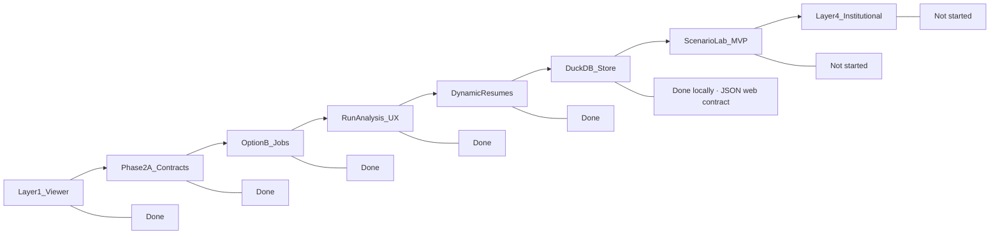

# Selection Room Vision — Progress Assessment

**Last updated:** 2026-07-03 (post platform layer + hosted architecture design doc)

**Sources:** [`.cursor/plans/selection_room_vision_5f27cf0d.plan.md`](.cursor/plans/selection_room_vision_5f27cf0d.plan.md), [`.cursor/plans/selection_stability_visual_6f4f62ca.plan.md`](.cursor/plans/selection_stability_visual_6f4f62ca.plan.md), [`.cursor/plans/option_b_run_jobs_e25d06fb.plan.md`](.cursor/plans/option_b_run_jobs_e25d06fb.plan.md), [`.cursor/plans/duckdb_run_store_39aea488.plan.md`](.cursor/plans/duckdb_run_store_39aea488.plan.md).

**Mental model:** Platform foundation is mostly done. Decision-support product is still not done. Do not confuse the two.

---

## Four-layer current state

| Layer | Description | Status |
|-------|-------------|--------|
| **Layer 1 — Viewer** | Explainability, bracket, charts, stability UI | **Done** |
| **Layer 2 — Platform foundation** | Jobs, run workspace, dynamic resumes, local DuckDB | **Done locally** — JSON web contract; OSS workflow intact |
| **Layer 2H — Hosted production** | Vercel + worker + object storage + Postgres adapters | **Designed, not implemented** — see [`docs/architecture/hosted-production.md`](../../docs/architecture/hosted-production.md) |
| **Layer 3 — Decision platform** | Scenario Lab (what-if, diffs) | **Not started** |
| **Layer 4 — Institutional / share** | Validation dashboard, export, share URLs | **Not started** |

**Critical distinction:** Option B and DuckDB do **not** count as Scenario Lab. They **make Scenario Lab possible**. Future agents should not re-polish Phase 1 or treat infrastructure as product completion.

---

## Current-state framing

Selection Room is no longer just a **polished JSON viewer**. It is a **run-capable analysis workspace** on localhost or a persistent Node server: browser run generation, in-page run switching, run-grounded team narratives, and a local analytical store.

It is **not yet** a true **what-if decision platform** because Scenario Lab has not shipped. That remains the next product leap.

**Platform honesty:** Layer 2 platform foundation is **done locally**. Layer 2H hosted production architecture is **designed, not implemented**. Phrase as: *local OSS platform complete; hosted adapters and worker stack not built yet.*

---

## North star (unchanged)

> Selection Room is a **guided decision platform**, not a dashboard.

The six-step user flow:

| Step | Status |
|------|--------|
| 1. See the field | **Strong** — Dashboard projected field, rankings, bubble board |
| 2. Understand the rule path | **Strong** — Methodology uses centralized `MetricTooltip` + [`METRIC_EXPLANATIONS`](web/lib/explain.ts) via [`MethodologyWeightBreakdown.tsx`](web/components/methodology/MethodologyWeightBreakdown.tsx) |
| 3. Inspect any team | **Strong** — Drawer + hover cards; `?run=` scoping; run-grounded `selection_case` |
| 4. Understand the bubble | **Strong** — Cut-line chart + Selection Stability board + audit |
| 5. Test what would change | **Not started** — No Scenario Lab UI |
| 6. Share or export the result | **Minimal** — Bracket share button only; brand/PWA metadata ahead of Phase 3 export layer |

### Platform enablers (not user-facing steps)

| Enabler | Helps step | How |
|---------|------------|-----|
| Option B jobs | 5, 6 | Launch engine runs from browser without terminal |
| `scenario_id` + `config_hash` (2A) | 5 | Scenario runs do not collide with base |
| DuckDB store | 5 | Diff queries for field/bubble/bracket (CLI + future Scenario Lab). **Pages still read JSON.** |
| Run Analysis modal | 1, 5, 6 | Create / switch / job status in-page — no admin `/runs` route |
| `selection_case` | 3, 4 | Run-grounded why-in/concerns, not static blurbs |

**DuckDB doctrine (repeat everywhere):** DuckDB powers run catalog, dev analytics, and future diffs; **JSON remains the page-rendering contract.** Do not convert the whole app to DB reads early.

---

## Roadmap progress (locked build order)

---

## Summary scorecard

| Area | Status |
|------|--------|
| Phase 1A–1C Explainability / Bracket / Charts | **Done** |
| Phase 2A Contracts + SSI | **Done** |
| Phase 2B SSI UI | **Done** |
| Option B run jobs | **Done** (local/persistent-server) |
| Run Analysis workspace | **Done** |
| Dynamic resume explanations | **Done** |
| Phase 2C DuckDB store | **Done** (local analytics; JSON web contract) |
| Layer 2H Hosted architecture | **Designed** — [`docs/architecture/hosted-production.md`](../../docs/architecture/hosted-production.md); adapters not built |
| Scenario Lab | **Not started** |
| Phase 3 validation/export/share | **Not started** |

**Progress (qualitative):**

- **Visualization/explainability:** mature
- **Platform foundation:** strong locally; hosted production designed but not implemented
- **Decision-support:** incomplete until Scenario Lab ships
- **Institutional layer:** not started

**Progress (optional numeric):**

- ~90% front-end visualization/explainability
- ~55% platform foundation — because hosting/deployment is not proven
- ~40% true decision-support platform

The next major product gap is **not** bracket polish, logos, or more hover cards. It is **Scenario Lab MVP** — because that completes north-star step 5.

---

## Phase details

### Phase 1A — Explainability — **Done**

- [`InfoTooltip`](web/components/explain/InfoTooltip.tsx) (+ Metric/Badge variants)
- Central copy in [`web/lib/explain.ts`](web/lib/explain.ts)
- [`TeamHoverCard`](web/components/team/TeamHoverCard.tsx), [`MatchupHoverCard`](web/components/bracket/MatchupHoverCard.tsx)
- Drawer `?run=` scoping via [`useActiveRun`](web/components/team/useActiveRun.ts) + [`useTeamResumes`](web/components/team/useTeamResumes.ts)
- Methodology + dashboard wired to centralized tooltips

Optional remaining: native `title=` fallbacks on logos/conference badges (acceptable per plan).

---

### Phase 1B — Bracket flagship — **Done**

- Pod-first CFP layout ([`FullBracket.tsx`](web/components/bracket/FullBracket.tsx), [`RulesetBanner.tsx`](web/components/bracket/RulesetBanner.tsx))
- Full / Round / Matchups modes + matchup edge cards
- Share button on bracket viewer (copies current URL including `?run=`)

---

### Phase 1C — Signature visuals — **Done**

- `ResumePredictiveScatter` on Rankings
- `BubbleCutlineChart` on Bubble + dashboard mini
- Collapsible bubble audit

---

### Phase 2A — Scenario contracts + SSI — **Done**

| Deliverable | Status |
|-------------|--------|
| Real Monte Carlo + `sensitivity.json` | Done |
| Scenario identity in `runs.json` | Done — `run_id`, `scenario_id`, `config_hash`, `weights`, `label` |
| `scenario_stem()` helpers | Done — [`src/pipeline/paths.py`](src/pipeline/paths.py) |
| Tests | Done — [`tests/test_run_identity.py`](tests/test_run_identity.py), [`tests/test_api_contracts.py`](tests/test_api_contracts.py) |

**Platform unlock:** Scenario outputs cannot overwrite base runs.

Minor doc gaps resolved in user-facing copy (Run Analysis, resume coverage wording). Master vision plan files are unchanged unless explicitly scoped.

---

### Phase 2B — SSI UI — **Done**

- Bubble `SelectionStabilityBoard`, drawer stability block, explain copy + fixtures

**Scenario Lab (rest of 2B product):** **Not started** — weight sliders, diffs, scenario launcher UI.

---

### Phase 2 platform (2B-infra + 2C) — **Done locally**

Architecture complete for local OSS / persistent-server dev. **Hosted production adapters not built** — see Layer 2H.

#### Option B — file-backed run jobs

- [`web/lib/runJob.ts`](web/lib/runJob.ts), [`web/app/api/run/`](web/app/api/run/)
- File-backed `data/output/jobs/` (metadata, logs, `active.json`)
- `POST /api/run` → 202 + `job_id`; capabilities probe; export lock
- Stem resolution: `SELECTION_ROOM_EXPORT stem=…` + `runs.json` fallback
- Gate: `SELECTION_ROOM_ENABLE_RUN_JOBS=1`

#### Run Analysis workspace

- [`RunAnalysisDialog.tsx`](web/components/layout/RunAnalysisDialog.tsx) — Create | Runs | Jobs tabs
- [`RunHeader.tsx`](web/components/layout/RunHeader.tsx), [`RunHeaderActions.tsx`](web/components/layout/RunHeaderActions.tsx)
- Shared catalog: [`useRunCatalog.ts`](web/lib/useRunCatalog.ts) + [`GET /api/runs/catalog`](web/app/api/runs/catalog/route.ts)
- Switcher shows current run label; same catalog as modal (no duplicate fetch)

#### Dynamic resume explanations

- [`src/api_contracts/selection_case.py`](src/api_contracts/selection_case.py) — run-grounded bullets
- [`tests/test_selection_case.py`](tests/test_selection_case.py)
- UI: [`ResumeContent.tsx`](web/components/team/ResumeContent.tsx)

#### Phase 2C — DuckDB run store

- [`src/store/`](src/store/), `data/output/selection_room.duckdb`
- Dual-write in [`export_run_api`](src/api_contracts/export.py); `SELECTION_ROOM_STORE_REQUIRED` policy
- CLI: `sroom store status | runs | query | rebuild --from-api`
- Tests: `tests/test_store_writer.py`, `tests/test_store_rebuild.py`, `tests/test_store_failure_policy.py`
- **Web pages still read JSON.** Catalog API uses DuckDB when available, `runs.json` fallback.

**Scenario Lab prerequisites now met:**

- Parameterized run launcher (Option B)
- Scenario-safe identity (2A)
- Local diff-friendly store (2C)
- In-app run switching (Run Analysis)

**Still to build for Scenario Lab:**

- Custom weights on `/api/run` or engine flag
- `ScenarioDiffService` boundary — `getScenarioDiff(baseStem, scenarioStem)`; local DuckDB/JSON vs hosted Postgres/artifact (see hosted architecture doc)
- Diff UI consuming that service — not scattered React compare logic
- Scenario Lab page + sliders

---

### Phase 3 — Institutional / share layer — **Not started**

| Priority | Status |
|----------|--------|
| Validation dashboard MVP | Not started — Python validation suite exists as CSV only |
| Export tools (bracket PNG, rankings CSV, resume card) | Not started |
| Shareable scenario URLs | Not started |
| Hosted adapters (H1–H7) | Designed — [`docs/architecture/hosted-production.md`](../../docs/architecture/hosted-production.md); implement before serious public launch |

Brand/PWA assets do not satisfy user flow step 6.

---

## Key files index (for future agents)

| Concern | Where |
|---------|-------|
| Run generation (Option B) | [`web/lib/runJob.ts`](web/lib/runJob.ts), [`web/app/api/run/`](web/app/api/run/) |
| Run catalog | [`web/lib/runCatalog.ts`](web/lib/runCatalog.ts), [`web/lib/useRunCatalog.ts`](web/lib/useRunCatalog.ts), [`web/app/api/runs/catalog/route.ts`](web/app/api/runs/catalog/route.ts) |
| Run UI / header | [`web/components/layout/RunHeader.tsx`](web/components/layout/RunHeader.tsx), [`web/components/layout/RunHeaderActions.tsx`](web/components/layout/RunHeaderActions.tsx), [`web/components/layout/RunAnalysisDialog.tsx`](web/components/layout/RunAnalysisDialog.tsx), [`web/components/layout/RunSwitcher.tsx`](web/components/layout/RunSwitcher.tsx) |
| JSON API contract | [`src/api_contracts/`](src/api_contracts/), [`docs/api-contracts.md`](docs/api-contracts.md) |
| Dynamic resume explanations | [`src/api_contracts/selection_case.py`](src/api_contracts/selection_case.py), [`tests/test_selection_case.py`](tests/test_selection_case.py) |
| Record metadata | [`src/api_contracts/records.py`](src/api_contracts/records.py), [`tests/test_team_records.py`](tests/test_team_records.py) |
| Run identity / scenario stems | [`src/pipeline/paths.py`](src/pipeline/paths.py), [`tests/test_run_identity.py`](tests/test_run_identity.py) |
| DuckDB store (local analytics) | [`src/store/`](src/store/), [`docs/development.md`](docs/development.md) (DuckDB section) |
| Hosted production architecture | [`docs/architecture/hosted-production.md`](../../docs/architecture/hosted-production.md) |
| Render bootstrap (secondary) | [`docs/hosting/render-feasibility-checklist.md`](../../docs/hosting/render-feasibility-checklist.md) |

---

## Locked next moves

0. **Hosted architecture doc + adapter design** — [`docs/architecture/hosted-production.md`](../../docs/architecture/hosted-production.md) (done); Run Analysis UX polish locally
1. **Scenario Lab MVP** — local adapters only; introduce `ScenarioDiffService` boundary
2. **Hosted Architecture H1–H7** — before serious public launch; not before Scenario Lab unless local architecture blocks
3. **Validation dashboard MVP** — credibility layer
4. **Share/export layer** — share URL, bracket PNG, rankings CSV
5. **Docs cleanup** — ongoing; Run Analysis and resume coverage wording updated in README, user-guide, web-app, api-contracts, output-files

**Doctrine:** JSON payload shape stays the web contract. Postgres holds metadata; object storage holds payloads. Do **not** expand DuckDB into web page reads. Do **not** build hosted adapters before Scenario Lab unless blocked. Do **not** re-polish Phase 1.

**Current true next move:** Run Analysis polish → Scenario Lab MVP on local adapters.

---

## Scenario Lab MVP scope (first version)

**In scope:**

- Start from a selected run
- Adjust model weights; normalize to 100%
- Launch scenario run
- Show moved in / moved out / stable
- Show updated field, bracket, bubble diff

**Out of scope for MVP:**

- User accounts
- Hosted adapters (H1–H7)
- Live simulation queue
- Complex animations
- Full Selection Stability recomputation UI
- Shareable scenario URLs

**Note:** Local DuckDB store exists for analytics/diffs; it is **not** a substitute for Scenario Lab UI.

---

## Bottom line

Phases 1 and 2A remain complete, and the platform layer is now in place for local or persistent-server usage: browser run generation, Run Analysis workspace, dynamic run-grounded resumes, and a local DuckDB analytical store. Selection Room is no longer just a JSON viewer; it is a run-capable analysis workspace. It is not yet a true what-if decision platform because Scenario Lab has not shipped. Scenario Lab is the next product leap because it completes north-star step 5, "Test what would change." Option B and DuckDB exist to make scenario launches, run switching, and diff queries boring to implement.
