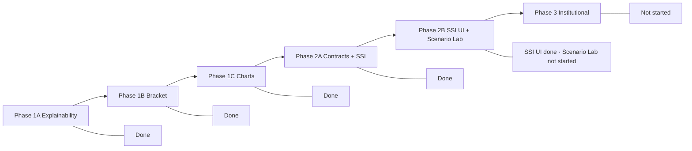

# Selection Room Vision — Progress Assessment

**Last updated:** 2026-07-03 (post-hardening session)

**Sources:** [`.cursor/plans/selection_room_vision_5f27cf0d.plan.md`](.cursor/plans/selection_room_vision_5f27cf0d.plan.md), [`.cursor/plans/selection_stability_visual_6f4f62ca.plan.md`](.cursor/plans/selection_stability_visual_6f4f62ca.plan.md), git history on `main`.

**Mental model:** You are no longer trying to finish Phase 1. You are at the **Scenario Lab threshold**.

---

## Current-state framing

Selection Room is a **polished CFP selection viewer** with strong explainability, bracket UX, bubble analytics, and real Selection Stability data. The next step is turning it into an **interactive decision platform** through Scenario Lab, then proving credibility through a Validation dashboard and making outputs shareable/exportable.

---

## North star (unchanged)

> Selection Room is a **guided decision platform**, not a dashboard.

The six-step user flow:

| Step | Status |
|------|--------|
| 1. See the field | **Strong** — Dashboard projected field, rankings, bubble board |
| 2. Understand the rule path | **Strong** — Methodology uses centralized `MetricTooltip` + [`METRIC_EXPLANATIONS`](web/lib/explain.ts) via [`MethodologyWeightBreakdown.tsx`](web/components/methodology/MethodologyWeightBreakdown.tsx) |
| 3. Inspect any team | **Strong** — Drawer + hover cards sitewide; `?run=` scoping fixed |
| 4. Understand the bubble | **Strong** — Cut-line chart + Selection Stability board + audit |
| 5. Test what would change | **Not started** — No Scenario Lab UI |
| 6. Share or export the result | **Minimal** — Bracket share button only; brand/PWA metadata shipped ahead of Phase 3 export layer |

---

## Roadmap progress (locked build order)



---

## Summary scorecard

| Area | Status |
|------|--------|
| Phase 1A Explainability | **Done** |
| Phase 1B Bracket flagship | **Done** |
| Phase 1C Signature visuals | **Done** |
| Phase 2A Contracts + SSI | **Done** |
| Phase 2B SSI UI | **Mostly done** — Bubble board + drawer block shipped |
| Scenario Lab | **Not started** |
| Phase 3 validation/export/share | **Not started** |

**Progress estimate:**

- ~85% through front-end visualization/explainability (Phases 1 + stability UI + brand)
- ~45% through true decision-support platform (Scenario Lab + validation + export still missing)
- ~70% through the locked six-phase roadmap by feature count

The next major product gap is **not** bracket polish, logos, or more hover cards. It is **Scenario Lab MVP** — because that completes user flow step 5.

---

## Phase details

### Phase 1A — Explainability — **Done**

**Commits:** `08b5915`, polish in `3e4e382`

- [`InfoTooltip`](web/components/explain/InfoTooltip.tsx) (+ Metric/Badge variants)
- Central copy in [`web/lib/explain.ts`](web/lib/explain.ts)
- [`TeamHoverCard`](web/components/team/TeamHoverCard.tsx), [`MatchupHoverCard`](web/components/bracket/MatchupHoverCard.tsx)
- Drawer `?run=` scoping via [`useActiveRun`](web/components/team/useActiveRun.ts) + [`useTeamResumes`](web/components/team/useTeamResumes.ts)
- Methodology + dashboard wired to centralized tooltips (`3e4e382`)

Optional remaining: native `title=` fallbacks on logos/conference badges (acceptable per plan).

---

### Phase 1B — Bracket flagship — **Done**

**Commits:** `6fb9ddb`, `20386ce`, `6eb53aa`, `9fc276b`, `d5e0e33`

- Pod-first CFP layout ([`FullBracket.tsx`](web/components/bracket/FullBracket.tsx), [`RulesetBanner.tsx`](web/components/bracket/RulesetBanner.tsx))
- Larger slots, CFP round labels, campus/QF summaries
- Full / Round / Matchups modes + matchup edge cards
- Share button on bracket viewer (copies current URL including `?run=`)

---

### Phase 1C — Signature visuals — **Done**

**Commit:** `af1fc31`

- `ResumePredictiveScatter` on Rankings
- `BubbleCutlineChart` on Bubble + dashboard mini
- Collapsible bubble audit
- `MetricContributionBars` correctly deferred

---

### Phase 2A — Scenario contracts + SSI — **Done**

**Commits:** `cb3fa41`, `6068b30`, `b59aa20`

| Deliverable | Status |
|-------------|--------|
| Real Monte Carlo + `sensitivity.json` | Done |
| Scenario identity in `runs.json` | Done — `run_id`, `scenario_id`, `config_hash`, `weights`, `label` |
| `scenario_stem()` helpers | Done — [`src/pipeline/paths.py`](src/pipeline/paths.py) |
| Manifest + index rebuild from filename | Done — prevents scenario/base collision |
| Tests | Done — [`tests/test_run_identity.py`](tests/test_run_identity.py), updated [`tests/test_api_contracts.py`](tests/test_api_contracts.py) |

**Platform unlock:** Scenario outputs can no longer overwrite base runs. Scenario Lab can be built cleanly on top of this.

Minor non-blocking gaps: no `sensitivity.json` export round-trip test; no N=1000 performance test; stale "SSI stub" in [`CHANGELOG.md`](CHANGELOG.md) and [`docs/research/limitations-and-ethics.md`](docs/research/limitations-and-ethics.md).

---

### Phase 2B — SSI UI shipped; Scenario Lab not started

Phase 2B is split:

- **Selection Stability UI is complete** for Bubble and Team Resume surfaces (`c4ae14c`, `4a29d56`, `e44b27d`)
- **The interactive Scenario Lab workflow has not started**

| Deliverable | Status |
|-------------|--------|
| Bubble `SelectionStabilityBoard` | Done |
| Drawer stability block | Done |
| Explain copy + TS types/fixtures | Done |
| Scenario Lab page + weight sliders | **Not started** |
| Ruleset toggle, field/bracket/bubble diff | **Not started** |
| Parameterized run launcher | **Not started** |
| SSI diff in Scenario Lab (2B-3) | **Not started** |

---

### Phase 3 — Institutional / share layer — **Not started**

| Priority (locked order) | Status |
|-------------------------|--------|
| Validation dashboard MVP | Not started — Python validation suite exists as CSV only |
| Export tools (bracket PNG, rankings CSV, resume card) | Not started |
| Shareable scenario URLs | Not started |
| Optional FastAPI / run store | Not started |

Brand/PWA assets (`9fc276b`) are ahead of this layer but do not satisfy user flow step 6.

---

## Working tree status

Clean on `main` after hardening session (commits `6eb53aa` → `b59aa20`).

Untracked: `uv.lock` only (leave alone unless intentionally standardizing dependency resolution).

---

## Locked next moves

1. **Scenario Lab MVP** — the main product leap
2. **Validation dashboard MVP** — credibility layer
3. **Share/export layer** — share URL, bracket PNG, rankings CSV (in that order)
4. **Remaining docs cleanup** — CHANGELOG + limitations SSI stub references (do not block Scenario Lab)

Do not start: user accounts, database/run store, live simulation queue, complex animations, full Scenario Stability recomputation UI, shareable scenario URLs. Those come after the workflow is proven.

---

## Scenario Lab MVP scope (first version)

**In scope:**

- Start from a selected run
- Adjust model weights
- Normalize weights to 100%
- Launch scenario run
- Show moved in / moved out / stable
- Show updated field
- Show updated bracket
- Show bubble diff

**Out of scope for MVP:**

- User accounts
- Database / run store
- Live simulation queue
- Complex animations
- Full Selection Stability recomputation UI
- Shareable scenario URLs

---

## Key commits (hardening session)

```
b59aa20  docs: mark Phase 2A scenario contracts complete in vision plan
6068b30  feat(api): add scenario-safe run identity to runs.json
3e4e382  fix(web): finish Phase 1 explainability polish
16efa78  test(api): cover team slot logo URL export fallback
9fc276b  feat(web): add Selection Room brand assets and app metadata
20386ce  refactor(web): extract full bracket layout and ruleset banner
6eb53aa  fix(web): unify team logo surfaces across charts and tiles
```

Foundation (earlier): `08b5915`, `6fb9ddb`, `af1fc31`, `cb3fa41`, `c4ae14c`–`e44b27d`.

---

## Bottom line

Phases 1 and 2A are complete. Selection Stability UI is mostly complete. **Stop polishing old phases.**

**Next real product leap: Scenario Lab MVP.**
