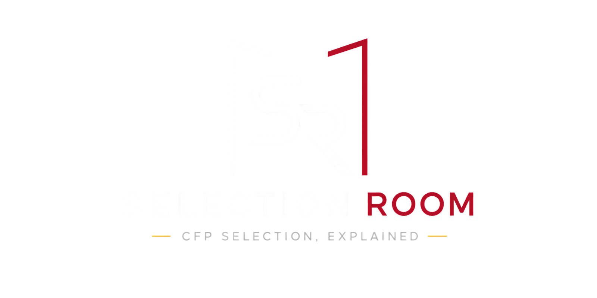

# Selection Room

_a CFP selection simulator_

<p align="center">
  
</p>

[](https://www.python.org/downloads/)
[](LICENSE)
[](https://github.com/psf/black)

A transparent, reproducible decision-support simulator for College Football Playoff ranking, selection, seeding, and bracket analysis.

The simulator runs from sample data in under a minute, generates a 12-team playoff field, explains why teams made or missed the bracket, and compares model outputs against CFP-style selection rules.

> [!NOTE]
> **v1 beta.** The **web app is the primary way to explore results**: run `make web`.
> The Python CLI and CSV/JSON exports are the engine underneath. The two runtime modes
> (local OSS and hosted) are compared in [Operating modes](#operating-modes) below.

<p align="center">
  
  
  
  
  
  
  
  
  
  
</p>

---

## What it does

**Engine**

- Composite rankings (resume, predictive, SOR, SOS)
- 12-team field selection under **2024** or **2025+** CFP rules
- Format-aware seeding and bracket generation
- Structured audit trail and reproducibility manifest
- Historical validation against published CFP rankings

**Selection Room web app**

- Projected field, rankings, and bubble/cut-line views with per-team resume drawers
- In-browser **Run Analysis**: launch a season/week run from sample or live CFBD data
- **Scenario Lab**: reweight the pillars and diff the resulting field, seeds, and bubble
- **Validation Dashboard**: committee alignment, field accuracy, and predictive-signal tracks across seasons
- **Export / share**: rankings CSV, bracket share image, and per-team resume cards

---

## Quickstart

> [!NOTE]
> No API key is required for `make demo`. Sample fixtures include conference champions so auto-bids and byes look realistic.

```bash
git clone https://github.com/XavierAgostino/cfp-selection-simulator.git
cd cfp-selection-simulator
make setup     # Python engine (.venv)
make demo      # first sample run (no API key needed)
make web       # Selection Room site at http://localhost:3000
```

The site walks you through setup if you open it first, and new analyses can
be launched from the run bar (**Run Analysis**): season, week, sample or
live CFBD data.

One-shot script: `./scripts/demo.sh` · Web app docs: [docs/web-app.md](docs/web-app.md)

### Operating modes

Two runtime modes share the same JSON contract and Python engine. Browsing is
open in both; the difference is how runs get launched.

| | **Local OSS** | **Hosted (Vercel + Supabase + Trigger)** |
|---|---------------|------------------------------------------|
| Data | `make demo` or your own runs, read from `data/output/` | Seeded official catalog in Supabase Storage + Postgres |
| Browsing | Open, no setup beyond `make demo` | Open to everyone, no account |
| Run Analysis | Optional subprocess jobs (`SELECTION_ROOM_ENABLE_RUN_JOBS=1`) | GitHub sign-in with a per-user daily quota; Trigger.dev worker |
| CFBD key | Required for live runs | Server/worker only |
| Setup | `make setup && make demo && make web` | [Hosted Runs v1](docs/hosting/hosted-runs-v1.md) |

On the hosted deployment, browsing the catalog needs no account; launching a run
requires a GitHub sign-in with a per-user daily quota (a legacy access code still
works as an optional bypass). No billing in v1.

---

## Run with live data

> [!IMPORTANT]
> Live runs need a free [College Football Data API](https://collegefootballdata.com/key) key in `.env` as `CFBD_API_KEY`.

```bash
cp .env.example .env   # put your CFBD_API_KEY in .env
make run YEAR=2025 WEEK=15
# or: ./bin/sroom run --year 2025 --week 15
# or: the Run Analysis button on the site
```

---

## Common commands

Use `make` or `./bin/sroom` from the repo root. Bare `sroom` requires `source .venv/bin/activate`.

| Goal | Command |
|------|---------|
| Environment check | `./bin/sroom doctor` |
| Sample demo | `make demo` |
| Full pipeline | `make run YEAR=2025 WEEK=15` |
| Web app | `make web` |
| Bracket HTML | `make bracket YEAR=2025 WEEK=15` |
| Latest outputs | `./bin/sroom outputs --latest` |
| Validation (all tracks) | `make validate` |
| Field validation only | `make validate-selection` |
| Predictive metrics only | `make validate-predictive` |
| DuckDB store status | `./bin/sroom store status` |
| Query run store | `./bin/sroom store query "SELECT * FROM runs LIMIT 5"` |
| Dev verification | `make verify` |

See [CLI Reference](docs/cli-reference.md) for all options.

---

## Example outputs

After `make demo`:

| File | Description |
|------|-------------|
| `data/output/rankings/2025_week15_rankings.csv` | Composite rankings |
| `data/output/fields/2025_week15_field.csv` | 12-team playoff field |
| `data/output/brackets/2025_week15_bracket.csv` | Seeded bracket |
| `data/output/brackets/2025_week15_bracket.html` | Interactive bracket |
| `data/output/audits/2025_week15_audit.json` | Selection audit |
| `data/output/runs/2025_week15_manifest.json` | Reproducibility manifest |

Details: [Output Files](docs/output-files.md)

**Data contracts:** JSON under `data/output/api/` powers the web app. Each export also writes a local DuckDB store at `data/output/selection_room.duckdb` for analytical queries (`sroom store`). See [Development Guide](docs/development.md#duckdb-run-store).

---

## Research-backed methodology

> [!NOTE]
> Selection Room is a **decision-support simulator**, not a claim to replicate closed-door committee deliberations.

One composite pipeline with explainable components.

**Documentation home:** [docs/index.md](docs/index.md) · **Research methodology:** [docs/research/index.md](docs/research/index.md)

| Topic | Doc |
|-------|-----|
| CFP format rules | [Format History](docs/research/cfp-format-history.md) |
| Committee alignment | [CFP Committee Alignment](docs/research/cfp-committee-alignment.md) |
| Ranking model | [Model Methodology](docs/research/model-methodology.md) |
| Metrics | [Metric Definitions](docs/research/metric-definitions.md) |
| Backtests | [Historical Validation](docs/research/historical-validation.md) |
| Stability | [Sensitivity Analysis](docs/research/sensitivity-analysis.md) |
| Scope | [Limitations & Ethics](docs/research/limitations-and-ethics.md) |

---

## CFP format support

| Era | Field | Seeding / byes |
|-----|-------|----------------|
| 2014–2023 | 4 teams | Use validation modules only |
| 2024 | 12 teams (5 auto + 7 at-large) | Top 4 **conference champions** get byes |
| 2025+ | 12 teams (5 auto + 7 at-large) | **Straight** seeding; top 4 overall get byes |

---

## Documentation

**Start here**

- [Documentation home](docs/index.md)
- [Quickstart](docs/quickstart.md)
- [User Guide](docs/user-guide.md)
- [CLI Reference](docs/cli-reference.md)
- [Output Files](docs/output-files.md)
- [Configuration](docs/configuration.md)

**Research**

- [Research index](docs/research/index.md)

**Contributors**

- [Contributing](CONTRIBUTING.md)
- [Development Guide](docs/development.md)
- [Project Structure](docs/project-structure.md)
- [Hosted Runs v1](docs/hosting/hosted-runs-v1.md): deploy the hosted app
- [Supabase setup](docs/hosting/supabase-setup.md)
- [Trigger worker setup](docs/hosting/trigger-worker.md)

---

## Development

```bash
make setup
make verify
```

---

## Roadmap

**v1 beta (now): local OSS and hosted.**

- Local OSS: full engine plus optional Run Analysis subprocess jobs.
- Hosted: Vercel + Supabase + Trigger.dev. Open browsing of the seeded catalog; run launch behind GitHub sign-in with a per-user daily quota ([Hosted Runs v1](docs/hosting/hosted-runs-v1.md)).

**Future (v1.1+), documented but not implemented:**

- **Shareable scenario URLs**: deep-link a Scenario Lab diff.
- **Billing and shareable authenticated links**: not in v1.

_Research track: V2 experiments (through V2.4) are implemented but intentionally do
not change v1 production defaults; full historical evaluation and V2.5 are deferred.
See [research methodology](docs/research/index.md)._

Adapter design history: [docs/architecture/hosted-production.md](docs/architecture/hosted-production.md).

---

## License & data

MIT License. See [LICENSE](LICENSE).

Game data via [College Football Data API](https://collegefootballdata.com/). Team logos may load from ESPN CDN fallbacks when a local asset is missing.

Author: **Xavier Agostino**
