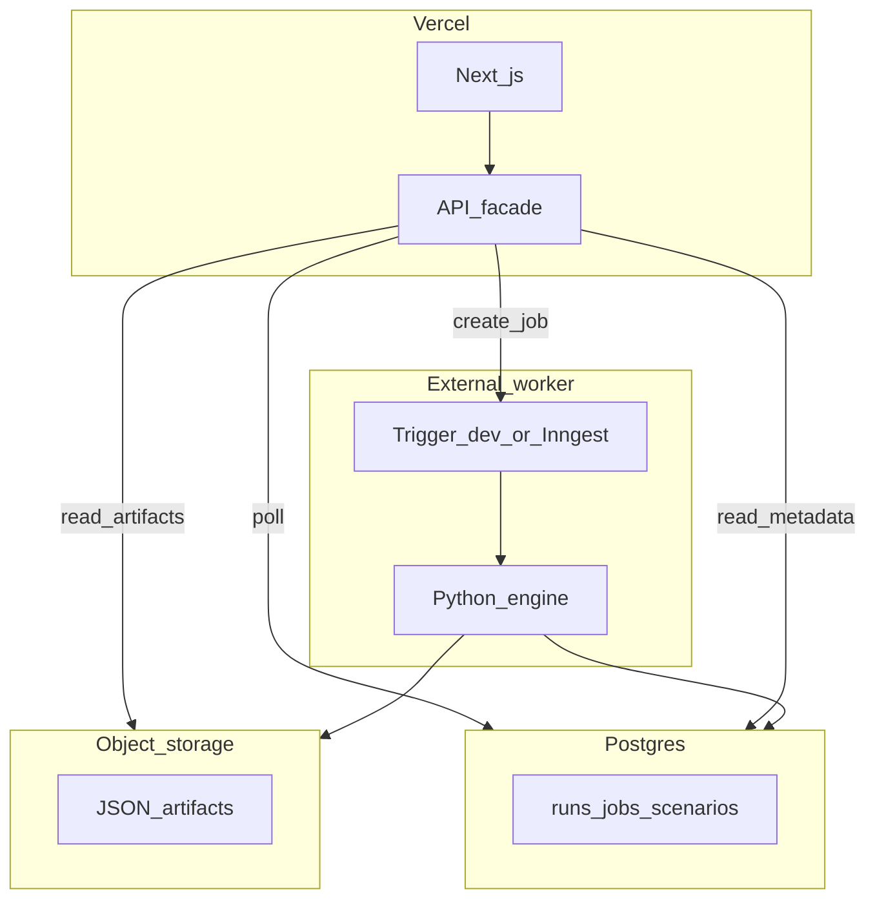

# Hosted Production Architecture

Selection Room supports **two operating modes** with the same JSON web contract and Python analytics engine:

1. **Local / open-source mode** — filesystem artifacts, DuckDB, subprocess jobs (today)
2. **Hosted production mode** — Vercel web, external worker, object storage, Postgres metadata (target)

This document is the architectural map. **No hosted adapters are implemented yet** — only the design and adapter boundaries.

**Doctrine:** JSON payload shape stays the web contract ([`docs/api-contracts.md`](../api-contracts.md)). Python remains the analytics source of truth. Local OSS workflow must keep working.

---

## Why two modes

Local mode is correct for contributors, CI, Scenario Lab MVP, and open-source use.

Hosted mode separates concerns for a serious public product:

| Concern | Local (today) | Hosted (target) |
|---------|---------------|-----------------|
| Web UI | Next.js (`pnpm dev` / self-host) | **Vercel** |
| Long-running Python | Subprocess on same machine | **External worker** (Trigger.dev or Inngest) |
| JSON artifacts | `data/output/api/` | **Object storage** (R2 / Vercel Blob / S3) |
| Run / job metadata | DuckDB + files + `runs.json` | **Postgres** (Neon via Vercel Marketplace) |
| DuckDB | Dual-write, CLI, local diffs | **Dev/worker-side only** — not central hosted state |

Vercel must **not** run multi-minute Python jobs inside normal serverless request handlers. Pattern: API creates job → worker executes → Vercel polls metadata and reads artifacts.

---

## Target topology



---

## Recommended stack

| Layer | Primary choice | Notes |
|-------|--------------|-------|
| Web | Vercel | Next.js 16 app |
| Jobs | **Trigger.dev** | Long runs, retries, queues, monitoring |
| Alt jobs | Inngest | Strong Vercel integration; step-based workflows |
| Artifacts | **Cloudflare R2** or Vercel Blob | R2 for portability/cost; Blob for fastest Vercel setup |
| Metadata | **Neon Postgres** (Vercel Marketplace) | Run catalog, jobs, scenarios, shares, validation summaries |
| Not recommended for metadata | DynamoDB alone | Weak for scenario diffs and analytical joins |
| Not for payloads | Edge Config, Redis | Config/cache — not run JSON |

---

## Postgres vs object storage (do not blur)

**Postgres** — metadata and queryable summaries only:

- Runs index (stem, scenario_id, config_hash, weights, artifact_prefix, …)
- Jobs (status, timestamps, stem, error)
- Scenarios, share links (later)
- Validation summaries (later)
- **Not** full `team-resumes.json` blobs unless there is a specific query reason

**Object storage** — full export payloads:

- `runs.json`, `latest.json`, `team-assets.json`
- `runs/{stem}/rankings.json`, `field.json`, `bracket.json`, `audit.json`, `team-resumes.json`, `sensitivity.json`

**DuckDB doctrine:** DuckDB powers local catalog, dev analytics, and worker-side diff prototyping. **JSON remains the page-rendering contract.** Hosted pages read artifacts from object storage via API routes; they do not read DuckDB on Vercel.

---

## Adapter boundaries

Four core interfaces (Python + TypeScript mirrors at the web boundary). Env selects implementation: `SELECTION_ROOM_MODE=local|hosted` (future).

### 1. `ArtifactStore`

Logical keys (unchanged layout):

```
runs.json
latest.json
team-assets.json
runs/{stem}/rankings.json
runs/{stem}/field.json
…
```

| Adapter | Implementation |
|---------|------------------|
| Local | `data/output/api/` — [`src/api_contracts/export.py`](../../src/api_contracts/export.py), [`web/app/api/data/[...path]/route.ts`](../../web/app/api/data/[...path]/route.ts) |
| Hosted | Vercel Blob / R2 / S3 SDK |

### 2. `RunCatalogStore`

Run index metadata (mirrors [`RunSummary`](../../web/lib/types.ts) / `runs.json` entries). **Not** full payloads.

| Adapter | Implementation |
|---------|------------------|
| Local | DuckDB + [`web/lib/runCatalog.ts`](../../web/lib/runCatalog.ts) |
| Hosted | Postgres `runs` table |

### 3. `JobStore`

Operational job state (replaces `data/output/jobs/*.json`).

| Adapter | Implementation |
|---------|------------------|
| Local | [`web/lib/runJob.ts`](../../web/lib/runJob.ts) |
| Hosted | Postgres `jobs` table (+ optional blob for log tails) |

### 4. `RunExecutor`

Who runs the Python engine.

| Adapter | Implementation |
|---------|------------------|
| Local | `spawn(.venv/bin/python -m src.cli.main run …)` |
| Hosted | Trigger.dev / Inngest task calling same pipeline |

Worker invokes [`run_pipeline`](../../src/pipeline/run.py) + export with hosted stores injected.

### 5. `ScenarioDiffService` (Scenario Lab — name now, implement with Scenario Lab)

Compare base run vs scenario run for product UI (moved in/out, rank/seed/bracket/bubble changes). **Do not scatter diff logic in React components.**

```text
getScenarioDiff(baseStem, scenarioStem) → ScenarioDiff
```

| Adapter | Implementation |
|---------|------------------|
| Local | DuckDB queries and/or JSON artifact compare |
| Hosted | Postgres summary rows and/or precomputed diff artifact in object storage |

Introduce during Scenario Lab MVP; keeps local and hosted diff contracts aligned.

---

## DuckDB role by environment

| Environment | Role |
|-------------|------|
| Local dev / OSS | Keep — dual-write, `sroom store`, Scenario Lab prototyping |
| CI | Optional — store tests stay filesystem-backed |
| Hosted worker | Optional — generate diff summaries before writing Postgres |
| Vercel / production metadata | **Not** central state |

---

## Bootstrap alternative: single-service hosting

A **Render-style monolith** (Next + Python + persistent disk in one container) is a **valid bootstrap / single-service path** for early deployment. It is **less aligned** with the long-term separation of web, worker, artifact storage, and metadata.

See [`docs/hosting/render-feasibility-checklist.md`](../hosting/render-feasibility-checklist.md) for feasibility checks. **Do not treat it as the primary architecture** for a multi-user, shareable, scalable product.

---

## Migration order (locked)

| Order | Work | Status |
|-------|------|--------|
| 0 | This doc + vision assessment update | **Done** |
| 0b | Run Analysis UX polish (local) | Pending |
| 1 | **Scenario Lab MVP** on local adapters | **Shipped** (`d81e91a`) |
| 2 | Validation dashboard MVP | **Shipped** (`98f1934`) |
| 3 | Share / export layer (rankings CSV, bracket image, resume card) | **Shipped** — scenario share URLs remain |
| 4 | Hosted Architecture H1–H7 (before public launch) | H3 done |

**Remaining before hosted work:** shareable scenario URLs (deep-link a scenario diff). The export primitives (rankings CSV, bracket share image, resume card) shipped with the local OSS product; hosting hardens around it.

### Hosted phase steps (H1–H7, future)

| Step | Work |
|------|------|
| H1 | Runtime adapter interfaces + local filesystem implementations | **Done** |
| H2 | Postgres schema + JobStore/RunCatalogStore for hosted metadata | **Done** |
| H3 | Supabase Storage artifact read path via `/api/data` | **Done** |
| H4 | Trigger.dev task: engine + artifacts + metadata | Not started |
| H5 | Vercel API: create job → worker; poll → Postgres |
| H6 | `SELECTION_ROOM_MODE=local|hosted` adapter selection |
| H7 | Seed: upload existing `data/output/api` to bucket |

---

## Postgres schema sketch (minimal v1)

```sql
-- Metadata only; payloads live in object storage
CREATE TABLE runs (
  stem TEXT PRIMARY KEY,
  run_id TEXT NOT NULL,
  scenario_id TEXT NOT NULL,
  label TEXT NOT NULL,
  season INT NOT NULL,
  week INT NOT NULL,
  ruleset TEXT,
  data_source TEXT NOT NULL,
  generated_at TIMESTAMPTZ NOT NULL,
  config_hash TEXT NOT NULL,
  weights JSONB NOT NULL,
  has_bracket BOOLEAN NOT NULL,
  has_sensitivity BOOLEAN NOT NULL,
  artifact_prefix TEXT NOT NULL  -- e.g. runs/2025_week15/
);

CREATE TABLE jobs (
  job_id TEXT PRIMARY KEY,
  status TEXT NOT NULL,
  season INT NOT NULL,
  week INT NOT NULL,
  data_source TEXT NOT NULL,
  stem TEXT,
  error TEXT,
  created_at TIMESTAMPTZ NOT NULL,
  started_at TIMESTAMPTZ,
  finished_at TIMESTAMPTZ,
  trigger_run_id TEXT
);
```

---

## Object storage layout

Bucket root `selection-room-artifacts/` mirrors current `data/output/api/`:

```
runs.json
latest.json
team-assets.json
runs/2025_week15/rankings.json
runs/2025_week15__scenario_abc/rankings.json
…
```

---

## Constraints (must hold)

- JSON wire format unchanged ([`docs/api-contracts.md`](../api-contracts.md))
- Python engine remains source of rankings, selection, export
- Local `make demo`, `sroom run`, `sroom store`, Option B jobs keep working
- No user accounts in v1
- Scenario Lab uses `RunExecutor` + `ArtifactStore` + `ScenarioDiffService` shapes
- Vercel never owns long-running Python subprocess

---

## Related docs

- [Vision progress assessment](../../.cursor/plans/vision_progress_assessment_ca926609.plan.md)
- [Render bootstrap checklist](../hosting/render-feasibility-checklist.md)
- [Development guide](../development.md) — local env vars, DuckDB, jobs
- [API contracts](../api-contracts.md)
