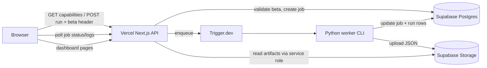

# Hosted Runs v1

Hosted Runs v1 lets a **hosted Vercel deployment** create live analysis runs without local Python setup. Users enter a **beta access code** in the browser; the server validates it, enqueues a background job, and the Python worker writes artifacts to Supabase Storage with metadata in Postgres.

No user accounts, Clerk, or billing are required for v1.

---

## Runtime modes

| Mode | Env signal | Run generation | UI |
|------|------------|----------------|-----|
| **Public demo** | `NEXT_PUBLIC_SELECTION_ROOM_DEMO_MODE=1` | Disabled | Read-only; Run Analysis hidden |
| **Local OSS** | Default (no `SELECTION_ROOM_RUNTIME=hosted`) | Optional subprocess jobs (`SELECTION_ROOM_ENABLE_RUN_JOBS=1`) | Setup wizard on first run; Option B job polling |
| **Hosted live beta** | `SELECTION_ROOM_RUNTIME=hosted` | Beta-code gated Trigger worker | Beta code in sessionStorage; job polling; no local setup copy |

These modes must stay isolated: demo users never see local setup instructions; hosted users never see `SELECTION_ROOM_ENABLE_RUN_JOBS` copy; local users keep the existing subprocess flow.

---

## Architecture



**Request path (create run):**

1. `POST /api/run` with season/week/source (and optional `weights` for Scenario Lab).
2. Beta code from `X-Selection-Room-Beta-Code` header or `beta_code` body field.
3. Gates: valid beta → no active job → daily cap → executor configured → CFBD available if live.
4. Insert `run_jobs` row (`queued`), enqueue Trigger task `run-hosted-job`.
5. Return `202 { job_id }`.

**Worker path:**

1. Trigger runs `python -m src.cli.main worker run-job <jobId>`.
2. Atomic transition `queued → running` in Postgres.
3. Run pipeline + export to temp dir, upload to Storage, insert/update `runs` (and `scenarios` when applicable).
4. Mark job `succeeded` or `failed`; append redacted logs to `run_jobs.logs_text`.

**Read path:**

- Catalog/jobs: Postgres via server adapters.
- Payloads: Supabase Storage proxied through `/api/data/*` (private bucket, service role on server only).

Completed runs open at `/dashboard?run=<stem>`.

---

## Beta access model

- **Server-side only:** `SELECTION_ROOM_BETA_ACCESS_CODE` or comma-separated `SELECTION_ROOM_BETA_RUN_CODES`.
- **Client:** user enters code in Run Analysis or Scenario Lab; stored in **`sessionStorage`** key `selection-room-beta-code` (not `localStorage`).
- **Transport:** `X-Selection-Room-Beta-Code` on `POST /api/run`.
- **Never exposed:** configured codes are not returned in capabilities JSON or logs. Beta codes are not forwarded to the worker subprocess env.

Capabilities (`GET /api/run/capabilities`) when `runtime === "hosted"` include:

- `requires_beta_code: true`
- `hosted_run_generation_available`
- `executor_configured`
- `daily_jobs_remaining`
- `active_job_id`
- `disabled_reason` when generation is unavailable

---

## Run lifecycle

| Step | Actor | State |
|------|-------|-------|
| Submit | Browser | POST `/api/run` |
| Gate | Vercel API | 401 / 409 / 429 / 503 / 501 or accept |
| Persist | Vercel API | `run_jobs.status = queued` |
| Enqueue | TriggerRunExecutor | Trigger task with `{ jobId }` only |
| Start | Worker | `running`, `started_at` set |
| Execute | Python | pipeline + export |
| Upload | Worker | Storage objects + Postgres `runs` |
| Complete | Worker | `succeeded`, `run_stem`, `artifact_base_url` |
| Poll | Browser | GET `/api/run/:id`, `/logs` every 2s |
| View | Browser | `/dashboard?run=<stem>` |

Scenario Lab uses the same POST path with a `weights` object; success loads diff via `/api/scenario/diff` and links to the scenario stem on the dashboard.

---

## Artifact layout

Storage bucket root mirrors local `data/output/api/`:

```
artifacts/
  runs.json
  latest.json
  team-assets.json
  runs/{stem}/rankings.json
  runs/{stem}/field.json
  runs/{stem}/bracket.json
  runs/{stem}/audit.json
  runs/{stem}/team-resumes.json
  runs/{stem}/sensitivity.json
```

Hosted v1 enforces **one active job globally** (`SELECTION_ROOM_HOSTED_MAX_CONCURRENT=1`), so `runs.json` / `latest.json` updates are serialized per completion. Postgres `runs` is the catalog source of truth in hosted mode.

---

## Job status lifecycle

```
queued → running → succeeded
                 → failed
                 → cancelled (reserved)
```

Poll endpoints:

- `GET /api/run/:jobId` — full job record
- `GET /api/run/:jobId/logs` — `{ lines: string[] }` from `logs_text`
- `GET /api/run/jobs` — recent jobs list

---

## Limitations (v1)

- Beta-code gated; no per-user accounts or quotas beyond daily cap + one active job.
- No billing, workspaces, or shareable authenticated links.
- Global daily job cap (`SELECTION_ROOM_HOSTED_DAILY_JOB_CAP`, default 10).
- One concurrent hosted job (`SELECTION_ROOM_HOSTED_MAX_CONCURRENT=1`).
- Live CFBD runs require `CFBD_API_KEY` on server/worker only.
- Worker must have Python, repo checkout, and network access to Supabase.
- Orphan Storage objects possible if a job fails after partial upload (see ops notes in hosting docs).
- Public demo deploy must **not** include hosted env vars.

---

## Related docs

| Doc | Purpose |
|-----|---------|
| [Supabase setup](supabase-setup.md) | Postgres migration, Storage bucket, RLS |
| [Trigger worker](trigger-worker.md) | Trigger.dev project, deploy, local worker test |
| [Hosted production architecture](../architecture/hosted-production.md) | Adapter design and migration history |
| [Public demo readiness](../release/public-demo-readiness.md) | Read-only Vercel demo (separate from hosted beta) |

---

## Manual smoke checklist

Use this after deploying hosted Vercel + Supabase + Trigger:

- [ ] `GET /api/run/capabilities` returns `runtime: "hosted"`, `requires_beta_code: true`
- [ ] Missing beta code → cannot submit; API returns 401 if forced
- [ ] Invalid beta code → 401, UI shows clear message
- [ ] Active job in progress → 409, UI shows busy state
- [ ] Daily cap exceeded → 429
- [ ] Executor not configured (no Trigger env) → 503, UI shows deployment unavailable message
- [ ] Successful job → `/dashboard?run=<stem>` loads rankings/field
- [ ] Scenario Lab hosted launch with weights → diff loads
- [ ] Job logs do not contain `CFBD_API_KEY`, service role key, DB URL, or beta codes
- [ ] Public demo project still has no hosted env vars and hides Run Analysis

---

## Security summary

| Secret | Where | Never |
|--------|-------|-------|
| `CFBD_API_KEY` | Server / Trigger worker | Browser, `NEXT_PUBLIC_*` |
| `SUPABASE_SERVICE_ROLE_KEY` | Server / worker | Browser, client bundles |
| `SELECTION_ROOM_DATABASE_URL` | Server / worker | Browser |
| `SELECTION_ROOM_BETA_*` | Server only | Capabilities response, logs, worker env |
| `TRIGGER_SECRET_KEY` | Vercel + Trigger | Browser |

Quota controls (`SELECTION_ROOM_HOSTED_MAX_CONCURRENT`, `SELECTION_ROOM_HOSTED_DAILY_JOB_CAP`) are required for hosted preview; do not disable them in production beta.
