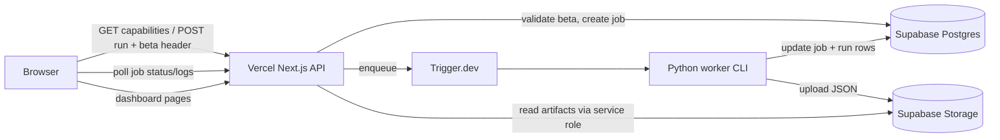

# Hosted Runs v1

Hosted Runs v1 lets a **hosted Vercel deployment** create live analysis runs without local Python setup. The server gates launch, enqueues a background job, and the Python worker writes artifacts to Supabase Storage with metadata in Postgres.

> **Gate update (single-product):** the launch gate is now **Supabase Auth (GitHub
> sign-in)** with a per-user daily quota, not a shared beta code. Browsing is fully
> open; only launching a run requires signing in. The legacy beta code still works as
> an optional header-only bypass. See
> [deployment-checklist.md → Sign-in gate](deployment-checklist.md) for setup. The
> sections below that describe the beta-code UX are retained for history.

---

## Runtime modes

| Mode | Env signal | Run generation | UI |
|------|------------|----------------|-----|
| **Local OSS** | Default (no `SELECTION_ROOM_RUNTIME=hosted`) | Optional subprocess jobs (`SELECTION_ROOM_ENABLE_RUN_JOBS=1`) | Setup wizard on first run; Option B job polling |
| **Hosted live** | `SELECTION_ROOM_RUNTIME=hosted` | GitHub sign-in gated Trigger worker | Sign in with GitHub to launch; job polling; no local setup copy |

The two modes stay isolated: hosted users never see `SELECTION_ROOM_ENABLE_RUN_JOBS` copy; local users keep the existing subprocess flow. (The former standalone read-only **Public demo** mode, `NEXT_PUBLIC_SELECTION_ROOM_DEMO_MODE`, was retired in the single-product cutover: the hosted deployment is now canonical and browsing its seeded catalog is open to everyone.)

---

## Architecture



**Request path (create run):**

1. `POST /api/run` with season/week/source (and optional `weights` for Scenario Lab).
2. User resolved from the Supabase Auth session cookie (or legacy `X-Selection-Room-Beta-Code` bypass).
3. Gates: signed in (or valid bypass) → per-user daily cap → executor configured → no active job → global daily cap → CFBD available if live.
4. Insert `run_jobs` row (`queued`, tagged with `user_id`), enqueue Trigger task `run-hosted-job`.
5. Return `202 { job_id }`.

**Worker path:**

1. Trigger runs `python -m src.cli.main worker run-job <jobId>`.
2. Atomic transition `queued → running` in Postgres.
3. Run pipeline + export to temp dir, upload to Storage, insert/update `runs` (and `scenarios` when applicable).
4. Mark job `succeeded` or `failed`; append redacted logs to `run_jobs.logs_text`.

**Read path:**

- Catalog/jobs: Postgres via server adapters.
- Payloads: Supabase Storage proxied through `/api/data/*` (private bucket, service role on server only).

Completed runs open at `/dashboard?run=<stem>`.

---

## Access model (GitHub sign-in)

- **Gate:** Supabase Auth with the GitHub provider. Public client config lives in
  `NEXT_PUBLIC_SUPABASE_URL` + `NEXT_PUBLIC_SUPABASE_ANON_KEY` (not secret; ships in the bundle).
- **Client:** `Sign in with GitHub` in Run Analysis / Scenario Lab (`SignInPanel`); the
  Supabase session lives in cookies, refreshed by `middleware.ts` on page navigations.
- **Transport:** the session cookie rides same-origin `POST /api/run`; the server resolves
  the user with `getRequestUser()`. No secret is sent from the browser.
- **Per-user quota:** `SELECTION_ROOM_HOSTED_USER_DAILY_JOB_CAP` (default 5), counted from
  `run_jobs.user_id` since the start of the UTC day, on top of the global caps.
- **Legacy bypass:** a valid `SELECTION_ROOM_BETA_RUN_CODES` value via the
  `X-Selection-Room-Beta-Code` header still authorizes a launch (for curl smoke); codes are
  never returned in capabilities or logs.

Capabilities (`GET /api/run/capabilities`) when `runtime === "hosted"` include:

- `requires_auth: true`
- `authenticated` (true when the request carries a valid session)
- `user_daily_jobs_remaining` (null when signed out)
- `hosted_run_generation_available`
- `executor_configured`
- `daily_jobs_remaining` (global)
- `active_job_id`
- `disabled_reason` when generation is unavailable

---

## Run lifecycle

| Step | Actor | State |
|------|-------|-------|
| Submit | Browser | POST `/api/run` |
| Gate | Vercel API | 401 / 409 / 429 / 503 / 501 or accept |
| Persist | Vercel API | `run_jobs.status = queued` |
| Enqueue | TriggerRunExecutor | Trigger task with `{ jobId }` only |
| Start | Worker | `running`, `started_at` set |
| Execute | Python | pipeline + export |
| Upload | Worker | Storage objects + Postgres `runs` |
| Complete | Worker | `succeeded`, `run_stem`, `artifact_base_url` |
| Poll | Browser | GET `/api/run/:id`, `/logs` every 2s |
| View | Browser | `/dashboard?run=<stem>` |

Scenario Lab uses the same POST path with a `weights` object; success loads diff via `/api/scenario/diff` and links to the scenario stem on the dashboard.

---

## Scheduled official runs

A Trigger.dev schedule (`weekly-official-run`, `web/trigger/weekly-official-run.ts`)
keeps the catalog's default field current without anyone launching by hand. It
fires **Tuesday 10pm ET**, right after the CFP committee's weekly release, resolves
the **latest committee week** from CFBD, and launches an official run (`user_id`
null, no per-user quota) through the same `run-hosted-job` path as user runs. So
the freshest run becomes the default view automatically.

Dormant unless `SELECTION_ROOM_OFFICIAL_RUN_ENABLED=1`; ships now, launches nothing
(zero CFBD quota) until the season is live. Env knobs and activation steps:
[deployment checklist → Weekly official run](deployment-checklist.md#weekly-official-run-scheduled).

---

## Artifact layout

Storage bucket root mirrors local `data/output/api/`:

```
artifacts/
  runs.json
  latest.json
  team-assets.json
  runs/{stem}/rankings.json
  runs/{stem}/field.json
  runs/{stem}/bracket.json
  runs/{stem}/audit.json
  runs/{stem}/team-resumes.json
  runs/{stem}/sensitivity.json
```

Hosted v1 enforces **one active job globally** (`SELECTION_ROOM_HOSTED_MAX_CONCURRENT=1`), so `runs.json` / `latest.json` updates are serialized per completion. Postgres `runs` is the catalog source of truth in hosted mode.

---

## Job status lifecycle

```
queued → running → succeeded
                 → failed
                 → cancelled (reserved)
```

Poll endpoints:

- `GET /api/run/:jobId`: full job record
- `GET /api/run/:jobId/logs`: `{ lines: string[] }` from `logs_text`
- `GET /api/run/jobs`: recent jobs list

---

## Limitations (v1)

- Run launch is gated by GitHub sign-in with a per-user daily quota (a legacy access code still works as an optional bypass). Browsing the catalog needs no account.
- No billing, workspaces, or shareable authenticated links.
- Global daily job cap (`SELECTION_ROOM_HOSTED_DAILY_JOB_CAP`, default 10).
- One concurrent hosted job (`SELECTION_ROOM_HOSTED_MAX_CONCURRENT=1`).
- Live CFBD runs require `CFBD_API_KEY` on server/worker only.
- Worker must have Python, repo checkout, and network access to Supabase.
- Orphan Storage objects possible if a job fails after partial upload (see ops notes in hosting docs).

---

## Related docs

| Doc | Purpose |
|-----|---------|
| [Supabase setup](supabase-setup.md) | Postgres migration, Storage bucket, RLS |
| [Supabase project (provisioned)](supabase-project.md) | Linked project ref and verification status |
| [Deployment checklist](deployment-checklist.md) | Trigger, Vercel, end-to-end smoke steps |
| [Trigger worker](trigger-worker.md) | Trigger.dev project, deploy, local worker test |
| [Hosted production architecture](../architecture/hosted-production.md) | Adapter design and migration history |

---

## Manual smoke checklist

Local script (reads Supabase CLI credentials, does not print secrets):

```bash
./scripts/hosted-smoke.sh
```

Use this after deploying hosted Vercel + Supabase + Trigger:

- [ ] `GET /api/run/capabilities` returns `runtime: "hosted"`, `requires_auth: true`, `authenticated: false`
- [ ] Signed out, no bypass → 401 `auth_required`; UI shows the GitHub sign-in gate
- [ ] Invalid beta bypass header → 401 `auth_required`
- [ ] Valid beta bypass (or signed-in session) → passes the auth gate
- [ ] Active job in progress → 409, UI shows busy state
- [ ] Per-user daily cap exceeded → 429 `user_daily_cap_exceeded`
- [ ] Global daily cap exceeded → 429
- [ ] Executor not configured (no Trigger env) → 503, UI shows deployment unavailable message
- [ ] Successful job → `/dashboard?run=<stem>` loads rankings/field
- [ ] Scenario Lab hosted launch with weights → diff loads
- [ ] Job logs do not contain `CFBD_API_KEY`, service role key, DB URL, or beta codes
- [ ] Signed-out visitor can browse the seeded catalog but cannot launch a run

---

## Security summary

| Secret | Where | Never |
|--------|-------|-------|
| `CFBD_API_KEY` | Server / Trigger worker | Browser, `NEXT_PUBLIC_*` |
| `SUPABASE_SERVICE_ROLE_KEY` | Server / worker | Browser, client bundles |
| `SELECTION_ROOM_DATABASE_URL` | Server / worker | Browser |
| `SELECTION_ROOM_BETA_*` | Server only | Capabilities response, logs, worker env |
| `TRIGGER_SECRET_KEY` | Vercel + Trigger | Browser |

Quota controls (`SELECTION_ROOM_HOSTED_MAX_CONCURRENT`, `SELECTION_ROOM_HOSTED_DAILY_JOB_CAP`) are required for hosted preview; do not disable them in production beta.
